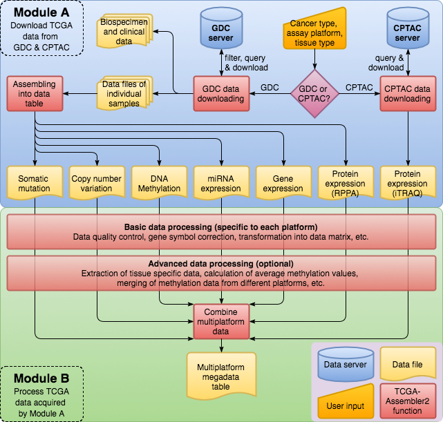

```{r include = FALSE}
knitr::opts_chunk$set(collapse = TRUE)
```

# Indtroduction

## Abstract




### Download

Download TCGA data from [GDC Legacy Archive](https://portal.gdc.cancer.gov/legacy-archive/search/f) with functions in Module A of [TCGA-Assembler 2](http://www.compgenome.org/TCGA-Assembler/).

For each platform, there is a `Download*` function, which will do the "download & pre-process" and return a __path__ to the result.

### summary (Download)

+ __*input*__
    + cancer type (e.g. BRCA)
+ __*function*__
    + `Download*` functions ([TCGA-Assembler 2](http://www.compgenome.org/TCGA-Assembler/))
        + platform specified function
        + download and pre-process TCGA data from [GDC](https://portal.gdc.cancer.gov/)
        + save result to disk
+ __*output*__
    + character vector of pathes to saved results


### Process

Process the downloaded data with functions in Module B of [TCGA-Assembler 2](http://www.compgenome.org/TCGA-Assembler/).

For each platform, there is a `Process*` function, which will do "platform-specified process" to the results from the __Download__ step, and return a `list` of 2 correlated `matrix` with same number of rows:

+ `Data` (numeric matrix of data)
    + `colnames`: TCGA barcode
+ `Des` (character matrix of description, acting as `rownames` of `Data`)
    + `colnames`: variant in different platforms:
        + `copyNumber`
            + `c("geneSymbolId, "chr", "strand")`
        + `somaticMutation`
            + `c("geneSymbolId, "Detail")`
        + `methylation`
            + `c("geneSymbolId, "SingleValueType")`
        + `geneExp`
            + `c("geneSymbolId, "EntrezID")`
        + `miRNAExp`
            + `c("geneSymbolId, "EntrezID")`
        + `protein_RPPA`
            + `c("geneSymbolId, "Antibody")`

### summary (Process)

+ __*input*__
    + downloaded & pre-processed data files
+ __*function*__
    + `Process*` functions ([TCGA-Assembler 2](http://www.compgenome.org/TCGA-Assembler/))
        + platform specified function
        + save result to disk
+ __*output*__
    + `list` of 2 `matrix`
        + `Data` (data, numeric matrix)
            + `colnames`: TCGA barcode
        + `Des` (description, character matrix)
            + `colnames`: gene symbol ID & platform detail
            + used as `rownames` of `Data`


*__Note__*:

+ All data are downloaded from [GDC Legacy Archive](https://portal.gdc.cancer.gov/legacy-archive/search/f).
+ More information could be found [here](http://www.compgenome.org/TCGA-Assembler/).

# Functions

## `clinical`

### `DownloadBiospecimenClinicalData`

#### Usage

```{r eval = FALSE}
DownloadBiospecimenClinicalData(cancerType,
                                saveFilePath = "./BiospecimenClinicalData",
                                saveFileName = "")
```

#### Description

The `DownloadBiospecimenClinicalData` function will:

1. download TCGA biospecimen and clinical data files of
    + specified cancer type (`cancerType`)
1. save files
    + in the specified folder (`saveFilePath`)
    + with the specified filename prefix (`saveFileName`)
1. return the paths of files

#### Parameters

##### `cancerType`

+ use: the "cancer type" of target TCGA data files
+ class: `character vector`
+ length: 1
+ options: TCGA cancer type abbreviation (1st column of [Table of "cancer type"](#table_cancerType))
+ default: None (specified by user is necessary)

##### `saveFilePath`

+ use: path of the directory to save downloaded data files
+ class: `character vector`
+ length: 1
+ default: `"./BiospecimenClinicalData"`

##### `saveFileName`

+ use: prefix of filenames of output data files
+ class: `character vector`
+ length: 1
+ default: `""` (empty string)

#### Details

This function retrieves the biospecimen and clinical data files, which are tab-delimited text files whose file type is called biotab on [GDC Legacy Archive](https://portal.gdc.cancer.gov/legacy-archive/search/f).
In the data files, patients that fit within the clinical data types of interest are indicated by TCGA barcode.
The downloaded data files have names composed of saveFileName and their original filenames, with "__" separating the two.
If saveFileName is an empty string, the names of the downloaded data files are the same as their original TCGA filenames.

#### Value

+ class: `character vector`
+ meaning: paths of downloaded files

#### Examples

```{r eval = FALSE}

# The present working directory of R must be TCGA-Assembler, i.e. the package folder, for running the examples.
source("Module_A.R")    # Load Module A functions
# Acquire biospecimen and clinical information of breast invasive carcinoma (BRCA) patients, save data files in the specified directory and add the prefix word "test" to the filenames.
filename_biosClin <- DownloadBiospecimenClinicalData(cancerType = "BRCA",
                                                     saveFilePath = "./ManualExampleData/RawData.TCGA-Assembler/BiospecimenClinicalData",
                                                     saveFileName = "test")

```

## `copyNumber`

### `DownloadCNAData`

#### Usage

```{r eval = FALSE}
DownloadCNAData(cancerType,
                assayPlatform = NULL,
                tissueType = NULL,
                saveFilePath = ".",
                saveFileName = "",
                inputPatientIDs = NULL)
```

#### Description

The `DownloadCNAData` function will:

1. download TCGA copy number variation data (`copyNumber`) which
    + belonging to the specified cancer type (`cancerType`) and tissue types (`tissueType`)
    + measured by the specified assay platform (`assayPlatform`)
1. combines data files (from different cases) into a tab-delimited data files
1. save the results
    + in the specified folder (`saveFilePath`)
    + with the specified filename prefix (`saveFileName`)
1. return the path of the saved result

#### Parameters

##### `cancerType`

+ use: the "cancer type" of target TCGA data files
+ class: `character vector`
+ length: 1
+ options: TCGA cancer type abbreviation (1st column of [Table of "cancer type"](#table_cancerType))
+ default: None (specified by user is necessary)

##### `assayPlatform`

+ use: the "assay platform" of target TCGA data files
+ class: `character vector`
+ length: variable
+ options: _all_ or _part_ of 1st column of [Table of "copy number"](#table_copyNumber)
+ default: `NULL` (i.e. _all_)

##### `tissueType`

+ use: the "tissue type" of target TCGA data files
+ class: `character vector`
+ length: variable
+ options: _all_ or _part_ of available TCGA tissue type abbreviations (1st column of [Table of "tissue type"](#table_tissueType))
+ default: `NULL` (i.e. _all_)

##### `saveFilePath`

+ use: path of the directory to save downloaded data files
+ class: `character vector`
+ length: 1
+ default: `"."` (current working directory)

##### `saveFileName`

+ use: prefix of filenames of output data files
+ class: `character vector`
+ length: 1
+ default: `""` (empty string)

##### `inputPatientIDs`

+ use: the "patients IDs" of target TCGA data files
+ class: `character vector`
+ options: TCGA barcodes (full or the first 12 characters, i.e. "TCGA-XX-XXXX")
+ length: variable
+ default: `NULL` (all available patients)

#### Details

For each assayPlatform, this function generates a tab-delimited data file.
The filename consists of five components:

1. `saveFileName` (optional)
1. `cancerType`
1. `assayPlatform` used to generate the data
1. specified tissue types connected by "_" or "tissueTypeAll" that indicates all available tissue types
1. the date and time when the data was downloaded

Double-underscore "__" is used to separate the five components in the filename.
If saveFileName is an empty string, the filenames consist of only the other four components.

The output data files have the format:

+ 1st row: column names
+ each other row: a DNA segment
+ 1st column: TCGA barcode
+ 2nd column: chromosome ID
+ 3rd column: start position of the segment
+ 4th column: end position of the segment
+ 5th column: number of probes in the segment
+ 6th column: copy number value transferred by base2 log(copyNumber/2), centered on 0

For more details of the data format, data type, and data generation pipeline, please refer to [TCGA](https://wiki.nci.nih.gov/display/TCGA/TCGA+Wiki+Home).

#### Value

+ class: `character vector`
+ meaning: paths of result files

#### Examples

```{r eval = FALSE}

# The present working directory of R must be TCGA-Assembler, i.e. the package folder, for running the examples.
source("Module_A.R")    # Load Module A functions
# Acquire copy number data of six rectum adenocarcinoma (READ) patient samples.
filename_READ_CNA <- DownloadCNAData(cancerType = "READ", assayPlatform = "cna_cnv.hg19", saveFilePath = "./ManualExampleData/RawData.TCGA-Assembler", inputPatientIDs = c("TCGA-EI-6884", "TCGA-DC-5869", "TCGA-G5-6572", "TCGA-F5-6812", "TCGA-AF-2692", "TCGA-AG-4021"))
# Acquire copy number data of all bladder urothelial carcinoma (BLCA) patient samples.
filename_BLCA_CNA <- DownloadCNAData(cancerType = "BLCA", assayPlatform = NULL, saveFilePath = "./ManualExampleData/RawData.TCGA-Assembler")
# Acquire copy number data of six breast invasive carcinoma (BRCA) patient samples.
filename_BRCA_CNA <- DownloadCNAData(cancerType = "BRCA", assayPlatform = "cna_cnv.hg19", saveFilePath = "./ManualExampleData/RawData.TCGA-Assembler", inputPatientIDs = c("TCGA-3C-AAAU", "TCGA-A7-A13F", "TCGA-BH-A0BZ", "TCGA-BH-A18N", "TCGA-BH-A18Q", "TCGA-BH-A18R" ) )

```

### `ProcessCNAData`

#### Usage

```{r eval = FALSE}
ProcessCNAData(inputFilePath,
               outputFileName,
               outputFileFolder = ".",
               refGenomeFile)
```

#### Description

The `ProcessCNAData` function will process DNA copy number data files from `DownloadCNAData` or [Firehose](https://confluence.broadinstitute.org/display/GDAC/Dashboard-Stddata):

1. calculate gene-level copy number
    + each row: a gene
    + each column: a sample identified by TCGA barcode
    + each element: average copy number in the genomic region of a gene
1. write the result as a tab-delimited data file
    + in the specified folder (`outputFileFolder`)
    + with specified filename (`outputFileName` + `".txt"`)
1. save the result (`list(Des, Data)`) to R data file (.rda)
    + in the specified folder (`outputFileFolder`)
    + with specified filename (`outputFileName` + `".rda"`)
1. draw and save a box plot of values by columns for quality control purpose
    + in the specified folder (`outputFileFolder`)
    + with specified filename (`outputFileName` + `"__boxplot.png"`)
1. return a `list` of 2 correlated `matrix` with same number of rows (genes): `Des` & `Data`:
    + `Data` (numeric matrix of data)
        + `colnames`: TCGA barcode
    + `Des` (character matrix of description, acting as `rownames` of `Data`)
        + `colnames`: `c("geneSymbolId, "chr", "strand")`

#### Parameters

##### `inputFilePath`

+ use: path of input file
+ class: `character vector`
+ length: 1
+ default: None (must be specified; and could not be `""`, i.e. empty string)

##### `outputFileName`

+ use: prefix of filenames of output data files
+ class: `character vector`
+ length: 1
+ default: None (must be specified; and could not be `""`, i.e. empty string)

##### `outputFileFolder`

+ use: path of the directory to save result files
+ class: `character vector`
+ length: 1
+ default: `"."` (current working directory)

##### `refGenomeFile`

+ use: path of gene genomic position annotation file
+ class: `character vector`
+ length: 1
+ options: path of one of gene genomic position annotation files in `"./SupportingFiles"`
    + `"dGeneHg18.rda"`: reference genome Hg18
    + `"dGeneHg19.rda"`: reference genome Hg19
+ default: `"SupportingFiles/dGeneHg19.rda"`

#### Value

+ class: `list` of 2 `matrix`
    + `Des`: character matrix
    + `Data`: numeric matrix
+ meaning: paths of result files

A list object formed by two variables Des and Data. Des is a character matrix of three columns including gene symbol, chromosome ID, and strand in the first, second, and third column, respectively. It describes the second variable, Data, which is a numeric matrix of gene-level copy number. Each column in Data is a sample and each row corresponds to a gene. The column names of Data are sample barcodes.

#### Examples

```{r eval = FALSE}

# The present working directory of R must be TCGA-Assembler, i.e. the package folder, for running the examples.
rm(list = ls()) # Clear workspace
source("Module_A.R")    # Load Module A functions
source("Module_B.R")    # Load Module B functions
# Download DNA copy number data of six rectum adenocarcinoma (READ) patient samples.
CNARawData <- DownloadCNAData(saveFilePath = "./ManualExampleData/RawData.TCGA-Assembler", cancerType = "READ", assayPlatform = "cna_cnv.hg19", inputPatientIDs = c("TCGA-EI-6884", "TCGA-DC-5869", "TCGA-G5-6572", "TCGA-F5-6812", "TCGA-AF-2692", "TCGA-AG-4021"))
# Process the downloaded copy number data and calculate an average copy number for each gene.
# Save results to subfolder ProcessedData.TCGA-Assembler in the ManualExampleData folder.
READ.GeneLevel.CNA <- ProcessCNAData(inputFilePath = CNARawData[1], outputFileName = "READ__genome_wide_snp_6__GeneLevelCNA", outputFileFolder = "./ManualExampleData/ProcessedData.TCGA-Assembler", refGenomeFile = "./SupportingFiles/Hg19GenePosition.txt")
# Process READ copy number data downloaded from Firehose website and calculate average copy number value, as well as save results to ./ManualExampleData/ProcessedData.Firehose/.
READ.GeneLevel.CNA <- ProcessCNAData(inputFilePath = "./ManualExampleData/RawData.Firehose/READ.snp__genome_wide_snp_6__broad_mit_edu__hg18__Level_3__segmented_scna_hg18__seg.seg.txt", outputFileName = "READ__genome_wide_snp_6__GeneLevelCNA", outputFileFolder = "./ManualExampleData/ProcessedData.Firehose", refGenomeFile = "./SupportingFiles/Hg18GenePosition.txt")
```

## `somaticMutation`

### `DownloadSomaticMutationData`

#### Usage

```{r eval = FALSE}
DownloadSomaticMutationData(cancerType,
                            assayPlatform = NULL,
                            tissueType = NULL,
                            saveFilePath = ".",
                            saveFileName = "",
                            inputPatientIDs = NULL,
                            supportFolderName = "./SupportingFiles")
```

#### Description

The `DownloadSomaticMutationData` function will:

1. download TCGA somatic mutation data (`somaticMutation`) which
    + belonging to the specified cancer type (`cancerType`) and tissue types (`tissueType`)
    + measured by the specified assay platform (`assayPlatform`)
1. save the results
    + in the specified folder (`saveFilePath`)
    + with the specified filename prefix (`saveFileName`)
1. return the path of the saved result

#### Parameters

##### `cancerType`

+ use: the "cancer type" of target TCGA data files
+ class: `character vector`
+ length: 1
+ options: TCGA cancer type abbreviation (1st column of [Table of "cancer type"](#table_cancerType))
+ default: None (specified by user is necessary)

##### `assayPlatform`

+ use: the "assay platform" of target TCGA data files
+ class: `character vector`
+ length: variable
+ options: _all_ or _part_ of 1st column of [Table of "somatic mutation"](#table_somaticMutation)
+ default: `NULL` (i.e. `"somaticMutation_DNAseq"`)

##### `tissueType`

+ use: the "tissue type" of target TCGA data files
+ class: `character vector`
+ length: variable
+ options: _all_ or _part_ of available TCGA tissue type abbreviations (1st column of [Table of "tissue type"](#table_tissueType))
+ default: `NULL` (i.e. _all_)

##### `saveFilePath`

+ use: path of the directory to save downloaded data files
+ class: `character vector`
+ length: 1
+ default: `"."` (current working directory)

##### `saveFileName`

+ use: prefix of filenames of output data files
+ class: `character vector`
+ length: 1
+ default: `""` (empty string)

##### `inputPatientIDs`

+ use: the "patients IDs" of target TCGA data files
+ class: `character vector`
+ options: TCGA barcodes (full or the first 12 characters, i.e. "TCGA-XX-XXXX")
+ length: variable
+ default: `NULL` (all available patients)

##### `supportFolderName`

a character string used as the path of the directory of Supporting files, whose default value is "./SupportingFiles".

#### Details

For each original somatic mutation data file, this function generates a tab-delimited data file.
The filename consists of five components:

1. `saveFileName` (optional)
1. `cancerType`
1. `assayPlatform` used to generate the data
1. specified tissue types connected by "_" or "tissueTypeAll" that indicates all available tissue types
1. the date and time when the data was downloaded

Double-underscore "__" is used to separate the five components in the filename.
If saveFileName is an empty string, the filenames consist of only the other four components.

The output data files have the format:

+ 1st row: column names
+ each other row: a mutation
+ columns: information of this mutation

For more details of the data format, data type, and data generation pipeline, please refer to [TCGA](https://wiki.nci.nih.gov/display/TCGA/TCGA+Wiki+Home).

#### Value

+ class: `character vector`
+ meaning: paths of result files

#### Examples

```{r eval = FALSE}

# The present working directory of R must be TCGA-Assembler, i.e. the package folder, for running the examples.
source("Module_A.R")    # Load Module A functions
# Acquire somatic mutation data of six breast invasive carcinoma (BRCA) patient samples.
filename_BRCA_somatic <- DownloadSomaticMutationData(cancerType = "BRCA",
                                                     assayPlatform = "somaticMutation_DNAseq",
                                                     saveFilePath = "./ManualExampleData/RawData.TCGA-Assembler",
                                                     inputPatientIDs = c("TCGA-E2-A1IU",
                                                                         "TCGA-A7-A13F",
                                                                         "TCGA-BH- A0BZ",
                                                                         "TCGA-BH-A18N",
                                                                         "TCGA-BH-A18Q",
                                                                         "TCGA-BH-A18R" ))
# Acquire somatic mutation data of glioblastoma multiforme (GBM) patient samples.
filename_GBM_somatic <- DownloadSomaticMutationData(cancerType = "GBM",
                                                    assayPlatform = "somaticMutation_DNAseq",
                                                    saveFilePath = "./ManualExampleData/RawData.TCGA-Assembler")

```

### `ProcessSomaticMutationData`

#### Usage

```{r eval = FALSE}
ProcessSomaticMutationData(inputFilePath,
                           outputFileName,
                           outputFileFolder = ".")
```

#### Description

The `ProcessSomaticMutationData` function will process somatic mutation data files from `DownloadSomaticMutationData`:

1. generate 2 levels of somatic mutation data from each original data file
    + mutation-level:
        + each row: a mutation
        + each column: a patient tumor/normal sample pair
        + each element: whether this sample pair has this mutation, 0 (no) or 1 (yes)
    +     gene-level:
        + each row: a gene
        + each column: a patient tumor/normal sample pair
        + each element: total number of somatic mutations in the genomic region of a gene in a tumor sample.
1. write the result as a tab-delimited data file
    + in the specified folder (`outputFileFolder`)
    + with specified filename
        + mutation-level: `outputFileName` + `"__mutationLevel"` + `".txt"`
        +     gene-level: `outputFileName` +     `"__geneLevel"` + `".txt"`
1. save the result (`list(Des, Data)`) to R data file (.rda)
    + in the specified folder (`outputFileFolder`)
    + with specified filename
        + mutation-level: `outputFileName` + `"__mutationLevel"` + `".rda"`
        +     gene-level: `outputFileName` +     `"__geneLevel"` + `".rda"`
1. draw and save a box plot of values by columns for quality control purpose
    + in the specified folder (`outputFileFolder`)
    + with specified filename (`outputFileName` + `"__boxplot.png"`)
1. return a `list` of 2 correlated `matrix` with same number of rows (genes): `Des` & `Data`:
    + `Data` (numeric matrix of data)
        + `colnames`: TCGA barcode
    + `Des` (character matrix of description, acting as `rownames` of `Data`)
        + `colnames`
            + mutation-level: `c("Hugo_Symbol", "Entrez_Gene_Id", ...)` (22 columns for mutation information)
            +     gene-level: `c("geneSymbolId, "Detail")`

#### Parameters

##### `inputFilePath`

+ use: path of input file
+ class: `character vector`
+ length: 1
+ default: None (must be specified; and could not be `""`, i.e. empty string)

##### `outputFileName`

+ use: prefix of filenames of output data files
+ class: `character vector`
+ length: 1
+ default: None (must be specified; and could not be `""`, i.e. empty string)

##### `outputFileFolder`

+ use: path of the directory to save result files
+ class: `character vector`
+ length: 1
+ default: `"."` (current working directory)

#### Value

A list object of two matrix variables representing the gene-level mutation data. The first variable is Des, which is a character matrix including two columns, i.e. gene symbol and classification information of variants in a gene. It serves as the description of the second variable, Data, which is a numeric matrix of counts of somatic mutations at gene level. Each column in the data matrix is a sample and the column name is TCGA sample barcode.

#### Details

This function transforms the mutation data into matrix format and save them. It further generates gene-level mutation data and save them, where the data are indicated by "geneLevel" in their filenames.

#### Examples

```{r eval = FALSE}

# The present working directory of R must be TCGA-Assembler, i.e. the package folder, for running the examples.
rm(list = ls()) # Clear workspace
source("Module_A.R")    # Load Module A functions
source("Module_B.R")    # Load Module B functions
# Acquire somatic mutation data of six breast invasive carcinoma (BRCA) patient samples.
filename_BRCA_somatic <- DownloadSomaticMutationData(cancerType = "BRCA", assayPlatform = "somaticMutation_DNAseq", saveFilePath = "./ManualExampleData/RawData.TCGA-Assembler", inputPatientIDs = c("TCGA-E2-A1IU", "TCGA-A7-A13F", "TCGA-BH- A0BZ", "TCGA-BH-A18N", "TCGA-BH-A18Q", "TCGA-BH-A18R" ))
# Process the downloaded BRCA somatic mutation data.
SomaticMutationData <- ProcessSomaticMutationData(inputFilePath = filename_BRCA_somatic[1], outputFileName = "BRCA_MutationData", outputFileFolder = "./ManualExampleData/ProcessedData.TCGA-Assembler")
# Acquire somatic mutation data of glioblastoma multiforme (GBM) patient samples.
filename_GBM_somatic <- DownloadSomaticMutationData(cancerType = "GBM", assayPlatform = "somaticMutation_DNAseq", saveFilePath = "./ManualExampleData/RawData.TCGA-Assembler")
# Process the downloaded GBM somatic mutation data.
SomaticMutationData <- ProcessSomaticMutationData(inputFilePath = filename_GBM_somatic[1], outputFileName = " GBM_MutationData", outputFileFolder = "./ManualExampleData/ProcessedData.TCGA-Assembler")

```

## `methylation`

### `DownloadMethylationData`

#### Usage

```{r eval = FALSE}
DownloadMethylationData(cancerType,
                        assayPlatform = NULL,
                        tissueType = NULL,
                        saveFilePath = ".",
                        saveFileName = "",
                        inputPatientIDs = NULL)
```

#### Description

The `DownloadMethylationData` function will:

1. download TCGA DNA methylation data (`methylation`) which
    + belonging to the specified cancer type (`cancerType`) and tissue types (`tissueType`)
    + measured by the specified assay platform (`assayPlatform`)
1. combines data files (from different cases) into a tab-delimited data files
1. save the results
    + in the specified folder (`saveFilePath`)
    + with the specified filename prefix (`saveFileName`)
1. return the path of the saved result

#### Parameters

##### `cancerType`

+ use: the "cancer type" of target TCGA data files
+ class: `character vector`
+ length: 1
+ options: TCGA cancer type abbreviation (1st column of [Table of "cancer type"](#table_cancerType))
+ default: None (specified by user is necessary)

##### `assayPlatform`

+ use: the "assay platform" of target TCGA data files
+ class: `character vector`
+ length: variable
+ options: _all_ or _part_ of 1st column of [Table of "methylation"](#table_methylation)
+ default: `NULL` (i.e. _all_)

##### `tissueType`

+ use: the "tissue type" of target TCGA data files
+ class: `character vector`
+ length: variable
+ options: _all_ or _part_ of available TCGA tissue type abbreviations (1st column of [Table of "tissue type"](#table_tissueType))
+ default: `NULL` (i.e. _all_)

##### `saveFilePath`

+ use: path of the directory to save downloaded data files
+ class: `character vector`
+ length: 1
+ default: `"."` (current working directory)

##### `saveFileName`

+ use: prefix of filenames of output data files
+ class: `character vector`
+ length: 1
+ default: `""` (empty string)

##### `inputPatientIDs`

+ use: the "patients IDs" of target TCGA data files
+ class: `character vector`
+ options: TCGA barcodes (full or the first 12 characters, i.e. "TCGA-XX-XXXX")
+ length: variable
+ default: `NULL` (all available patients)

#### Details

For each assayPlatform, this function generates a tab-delimited data file.
The filename consists of five components:

1. `saveFileName` (optional)
1. `cancerType`
1. `assayPlatform` used to generate the data
1. specified tissue types connected by "_" or "tissueTypeAll" that indicates all available tissue types
1. the date and time when the data was downloaded

Double-underscore "__" is used to separate the five components in the filename.
If saveFileName is an empty string, the filenames consist of only the other four components.

The output data files have the format:

+ 1st row: TCGA barcodes of samples
+ each other row: a CpG site
+ 1st column: index of CpG site
+ 2nd column: gene symbol
+ 3rd column: chromosome ID
+ 4th column: genomic coordinate of CpG site
+ each other column: "Beta_value" of a sample

For more details of the data format, data type, and data generation pipeline, please refer to [TCGA](https://wiki.nci.nih.gov/display/TCGA/TCGA+Wiki+Home).

#### Value

+ class: `character vector`
+ meaning: paths of result files

#### Examples

```{r eval = FALSE}

# The present working directory of R must be TCGA-Assembler, i.e. the package folder, for running the examples.
rm(list = ls())   # Clear workspace
source("Module_A.R")  # Load Module A functions
# Acquire humanmethylation450 data of six rectum adenocarcinoma (READ) patient samples.
filename_READ_Methylation450 <- DownloadMethylationData(cancerType = "READ",
                                                        assayPlatform = "methylation_450",
                                                        saveFilePath = "./ManualExampleData/RawData.TCGA-Assembler",
                                                        inputPatientIDs = c("TCGA-EI-6884",
                                                                            "TCGA-DC-5869",
                                                                            "TCGA-G5-6572",
                                                                            "TCGA-F5-6812",
                                                                            "TCGA-AG-A01W",
                                                                            "TCGA-AG-3731"))
# Acquire humanmethylation27 data of all rectum adenocarcinoma (READ) patient samples.
filename_READ_Methylation27 <- DownloadMethylationData(cancerType = "READ",
                                                       assayPlatform = "methylation_27",
                                                       saveFilePath = "./ManualExampleData/RawData.TCGA-Assembler")
# Acquire humanmethylation450 data of three breast invasive carcinoma (BRCA) patient samples.
filename_BRCA_Methylation450 <- DownloadMethylationData(cancerType = "BRCA",
                                                        assayPlatform = "methylation_450",
                                                        saveFilePath = "./ManualExampleData/RawData.TCGA-Assembler",
                                                        inputPatientIDs = c("TCGA-3C-AAAU",
                                                                            "TCGA-A7-A13F",
                                                                            "TCGA-BH-A0BZ"))
# Acquire humanmethylation27 data of four breast invasive carcinoma (BRCA) patient samples.
filename_BRCA_Methylation27 <- DownloadMethylationData(cancerType = "BRCA",
                                                       assayPlatform = "methylation_27",
                                                       saveFilePath = "./ManualExampleData/RawData.TCGA-Assembler",
                                                       inputPatientIDs = c("TCGA-A1-A0SD",
                                                                           "TCGA-BH-A18N",
                                                                           "TCGA-BH-A18Q",
                                                                           "TCGA-BH-A18R"))

```

### `ProcessMethylation27Data`

#### Usage

```{r eval = FALSE}
ProcessMethylation27Data(inputFilePath,
                         outputFileName,
                         outputFileFolder = ".",
                         fileSource = "TCGA-Assembler")
```

#### Description

First, the `ProcessMethylation27Data` function will process HumanMethylation27 BeadChip data files from `DownloadMethylationData` or [Firehose](https://confluence.broadinstitute.org/display/GDAC/Dashboard-Stddata):

1. map the CpG sites to genes with annotation files
    + each row: a CpG site with gene information
    + each column: a sample identified by TCGA barcode
    + each element:
1. write the result as a tab-delimited data file
    + in the specified folder (`outputFileFolder`)
    + with specified filename (`outputFileName` + `".txt"`)
1. save the result (`list(Des, Data)`) to R data file (.rda)
    + in the specified folder (`outputFileFolder`)
    + with specified filename (`outputFileName` + `".rda"`)
1. draw and save a box plot of values by columns for quality control purpose
    + in the specified folder (`outputFileFolder`)
    + with specified filename (`outputFileName` + `"__boxplot.png"`)
1. return a `list` of 2 correlated `matrix` with same number of rows (genes): `Des` & `Data`:
    + `Data` (numeric matrix of data)
        + `colnames`: TCGA barcode
    + `Des` (character matrix of description, acting as `rownames` of `Data`)
        + `colnames`: `c("REF", "GeneSymbol", "ChromosomeID", "CoordinateID")`


This function processes HumanMethylation27 BeadChip data file either acquired by TCGA-Assembler Module A or downloaded from Firehose, and imports the data into R. It does the following.

For data files downloaded from Firehose, remove redundant columns in the data. Firehose HumanMethylation27 data file includes replicated columns of probe descriptions, i.e. gene symbol, chromosome ID, genomic coordinate, which are identical for each sample.
Check whether the gene symbols are official HGNC gene symbols. If not, correct them.

When a CpG site corresponds to more than one gene symbol, duplicate the measurements of the CpG site (a row in the data matrix) for each gene symbol.

Draw and save a box plot of the data for quality control purpose. The picture filename is composed of outputFileName and "__boxplot.png".
Save the processed data as a tab-delimited .txt file. The first four columns are Illumina ID of CpG site, gene symbol, chromosome ID, and genome coordinate. The other columns are data of individual samples. The top row gives the TCGA sample barcodes.
Save the processed data as an R data file (.rda), which includes two variables Des and Data. Des is a character matrix including the four-column description of CpG sites. It serves as the description of Data, which is a numeric matrix. Each column in the data matrix is a sample and the column names are sample barcodes.
The output .txt file and .rda file contain the same data. Having the same data in two different file formats is for the convenience of using data under different software environments.

#### Parameters

##### `inputFilePath`

+ use: path of input file
+ class: `character vector`
+ length: 1
+ default: None (must be specified; and could not be `""`, i.e. empty string)

##### `outputFileName`

+ use: prefix of filenames of output data files
+ class: `character vector`
+ length: 1
+ default: None (must be specified; and could not be `""`, i.e. empty string)

##### `outputFileFolder`

+ use: path of the directory to save result files
+ class: `character vector`
+ length: 1
+ default: `"."` (current working directory)

##### `fileSource`

a character string, either TCGA-Assembler or Firehose. TCGA-Assembler, which is the default setting, indicates that the input data file was acquired by TCGA-Assembler Module A and Firehose indicates that the input data file was downloaded from Firehose website.

#### Value

A list object of two variables, which are Des and Data. Des is a character matrix of the four-column description of CpG sites including Illumina ID of CpG site, gene symbol, chromosome ID, and genomic coordinate. It serves as the description of the second variable, Data, which is a numeric matrix. Each column in the matrix is a sample and the column names are the TCGA sample barcodes.

#### Examples

```{r eval = FALSE}

# The present working directory of R must be TCGA-Assembler, i.e. the package folder, for running the examples.
rm(list = ls()) # Clear workspace
source("Module_A.R")    # Load Module A functions
source("Module_B.R")    # Load Module B functions
# Download humanmethylation27 data of six rectum adenocarcinoma (READ) patient samples.
Methylation27RawData <- DownloadMethylationData(saveFilePath = "./ManualExampleData/RawData.TCGA-Assembler",
                                                cancerType = "READ",
                                                assayPlatform = "methylation_27",
                                                inputPatientIDs = c("TCGA-AG-3583",
                                                                    "TCGA-AG-A032",
                                                                    "TCGA-AF-2692",
                                                                    "TCGA-AG-4001",
                                                                    "TCGA-AG-3608",
                                                                    "TCGA-AG-3574"))
# Process the downloaded humanmethylation27 data and save the results to ./ManualExampleData/ProcessedData.TCGA-Assembler.
Methylation27Data <- ProcessMethylation27Data(inputFilePath = Methylation27RawData[1],
                                              outputFileName = "READ__humanmethylation27",
                                              outputFileFolder = "./ManualExampleData/ProcessedData.TCGA-Assembler")
# Process READ HumanMethylation27 data downloaded from Firehose website and save the results to ./ManualExampleData/ProcessedData.Firehose.
Methylation27Data <- ProcessMethylation27Data(inputFilePath = "./ManualExampleData/RawData.Firehose/READ.methylation__humanmethylation27__jhu_usc_edu__Level_3__within_bioassay_data_set_function__data.data.txt",
                                              outputFileName = "READ__humanmethylation27",
                                              outputFileFolder = "./ManualExampleData/ProcessedData.Firehose",
                                              fileSource = "Firehose")

```

### `ProcessMethylation450Data`

#### Usage

```{r eval = FALSE}
ProcessMethylation450Data(inputFilePath,
                          outputFileName,
                          outputFileFolder = ".",
                          fileSource = "TCGA-Assembler")
```

#### Description

First, the `ProcessMethylation450Data` function will process files from `DownloadMethylationData` or [Firehose](https://confluence.broadinstitute.org/display/GDAC/Dashboard-Stddata):

1. map the CpG sites to genes with annotation files
    + each row: a gene
    + each column: a sample identified by TCGA barcode
    + each element:
1. write the result as a tab-delimited data file
    + in the specified folder (`outputFileFolder`)
    + with specified filename (`outputFileName` + `".txt"`)
1. save the result (`list(Des, Data)`) to R data file (.rda)
    + in the specified folder (`outputFileFolder`)
    + with specified filename (`outputFileName` + `".rda"`)
1. draw and save a box plot of values by columns for quality control purpose
    + in the specified folder (`outputFileFolder`)
    + with specified filename (`outputFileName` + `"__boxplot.png"`)
1. return a `list` of 2 correlated `matrix` with same number of rows (genes): `Des` & `Data`:
    + `Data` (numeric matrix of data)
        + `colnames`: TCGA barcode
    + `Des` (character matrix of description, acting as `rownames` of `Data`)
        + `colnames`: `c("REF", "GeneSymbol", "ChromosomeID", "CoordinateID")`


This function processes HumanMethylation450 BeadChip data file either acquired by TCGA-Assembler Module A or downloaded from Firehose website, and imports the data into R. It does the following.

For HumanMethylation450 data file downloaded from Firehose website, remove redundant columns in the data. Firehose HumanMethylation450 data file includes replicated columns of probe descriptions, i.e. gene symbol, chromosome ID, genomic coordinate, which are identical for each sample. This redundant information makes the file size very large, more than 10GB for some cancer types, which produces difficulties when loading the data into software environment for data analysis, such as R.
Check whether the gene symbols are official HGNC gene symbols. If not, correct them.
When a CpG site corresponds to more than one gene symbol, duplicate the measurements of the CpG site (a row in the data matrix) for each gene symbol that it stands for.
Draw and save a box plot of the data for quality control purpose. The picture filename is composed of outputFileName and "__boxplot.png".
Save the processed data as a tab-delimited .txt file. The first four columns are Illumina ID of CpG site, gene symbol, chromosome ID, and genomic coordinate. The other columns are data of individual samples. The top row gives the TCGA sample barcodes.
Save the processed data as an R data file (.rda), which contains two variables Des and Data. Des is a character matrix including the four-column description of CpG sites. It serves as the description of the second variable, Data, which is a numeric matrix. Each column in Data is a sample and the column names of Data are TCGA sample barcodes.
The output .txt file and .rda file contain the same data. Having the same data in two different file formats is for the convenience of using data under different software environments.

#### Parameters

##### `inputFilePath`

+ use: path of input file
+ class: `character vector`
+ length: 1
+ default: None (must be specified; and could not be `""`, i.e. empty string)

##### `outputFileName`

+ use: prefix of filenames of output data files
+ class: `character vector`
+ length: 1
+ default: None (must be specified; and could not be `""`, i.e. empty string)

##### `outputFileFolder`

+ use: path of the directory to save result files
+ class: `character vector`
+ length: 1
+ default: `"."` (current working directory)

##### `fileSource`

a character string, either TCGA-Assembler or Firehose. TCGA-Assembler, which is the default setting, indicates that the input data file was acquired by TCGA-Assembler Module A, and Firehose indicates that the input data file was downloaded from Firehose website.

#### Value

A list object formed by Des and Data. Des is a character matrix of four-column descriptions of CpG sites including Illumina ID of CpG site, gene symbol, chromosome ID and genomic coordinate. It serves as the description of the second variable, Data, which is a numeric matrix. Each column in Data is a sample and the column names of Data are TCGA sample barcodes.

#### Details

For HumanMethylation450 data file downloaded from Firehose, this function calls GetMethylation450Data function to read in the data file and get rid of the redundant columns of CpG site descriptions. GetMethylation450Data function reads and processes the data file block by block to circumvent potential memory limitation problem caused by large sizes of Firehose data files (>10GB for some cancer types).

#### Examples

```{r eval = FALSE}

# The present working directory of R must be TCGA-Assembler, i.e. the package folder, for running the examples.
rm(list = ls()) # Clear workspace
source("Module_A.R")    # Load Module A functions
source("Module_B.R")    # Load Module B functions
# Download humanmethylation450 data of six rectum adenocarcinoma (READ) patient samples.
Methylation450RawData <- DownloadMethylationData(saveFilePath = "./ManualExampleData/RawData.TCGA-Assembler",
                                                 cancerType = "READ",
                                                 assayPlatform = "methylation_450",
                                                 inputPatientIDs = c("TCGA-EI-6884",
                                                                     "TCGA-DC-5869",
                                                                     "TCGA-G5-6572",
                                                                     "TCGA-F5-6812",
                                                                     "TCGA-AG-A01W",
                                                                     "TCGA-AG-3731"))
# Process the downloaded humanmethylation450 data and save the results to ProcessedData.TCGA-Assembler subfolder.
Methylation450Data <- ProcessMethylation450Data(inputFilePath = Methylation450RawData[1],
                                                outputFileName = "READ__humanmethylation450",
                                                outputFileFolder = "./ManualExampleData/ProcessedData.TCGA-Assembler")
# Process READ HumanMethylation450 data downloaded from Firehose website.
Methylation450Data <- ProcessMethylation450Data(inputFilePath = "./ManualExampleData/RawData.Firehose/READ.methylation__humanmethylation450__jhu_usc_edu__Level_3__within_bioassay_data_set_function__data.data.txt",
                                                outputFileName = "READ__humanmethylation450",
                                                outputFileFolder = "./ManualExampleData/ProcessedData.Firehose",
                                                fileSource = "Firehose")

```

### `MergeMethylationData`

#### Usage

```{r eval = FALSE}
MergeMethylationData(input1,
                     input2,
                     outputFileName,
                     outputFileFolder = ".")
```
#### Description


The `ProcessCNAData` function will process DNA copy number data files from `DownloadCNAData` or [Firehose](https://confluence.broadinstitute.org/display/GDAC/Dashboard-Stddata):

1. calculate gene-level copy number, which is the average copy number in the genomic region of a gene
    + each row: a gene
    + each column: a sample identified by TCGA barcode
    + each element:
1. write the result as a tab-delimited data file
    + in the specified folder (`outputFileFolder`)
    + with specified filename (`outputFileName` + `".txt"`)
1. save the result (`list(Des, Data)`) to R data file (.rda)
    + in the specified folder (`outputFileFolder`)
    + with specified filename (`outputFileName` + `".rda"`)
1. draw and save a box plot of values by columns for quality control purpose
    + in the specified folder (`outputFileFolder`)
    + with specified filename (`outputFileName` + `"__boxplot.png"`)
1. return a `list` of 2 correlated `matrix` with same number of rows (genes): `Des` & `Data`:
    + `Data` (numeric matrix of data)
        + `colnames`: TCGA barcode
    + `Des` (character matrix of description, acting as `rownames` of `Data`)
        + `colnames`: `c("REF", "GeneSymbol", "ChromosomeID", "CoordinateID")`


This function combines two methylation datasets together by doing the following:

Identify the CpG sites that appear in both datasets, and combine the data of these CpG sites.
Perform quantile normalization on the combined data.
Draw and save a box plot of the combined data before and after normalization for quality control purpose. The picture filenames are composed of outputFileName and "__BeforeNormalizationBoxplot.png" or "__AfterNormalizationBoxplot.png".
Save the normalized combined data as a tab-delimited .txt file. The first four columns are Illumina ID of CpG site, gene symbol, chromosome ID, and genomic coordinate. The other columns are data of individual samples. The first row gives TCGA barcodes of samples.
Save the normalized combined data as an R data file (.rda) that includes two variables. The first variable is Des, which is a character matrix including the four-column description of CpG sites. It serves as the description of the second variable, Data, which is a numeric matrix. Each column in the matrix corresponds to a sample and the column names are TCGA barcodes of samples.
The output .txt file and .rda file contain the same data. Having the same data in two different file formats is for the convenience of using data under different software environments.

#### Parameters

input1

a list object containing a methylation dataset to be merged. It is a list of two variables. One variable is Des, which is a four-column character matrix including Illumina ID of CpG site, gene symbol, chromosome ID, and genomic coordinate. The other variable is Data, a numeric matrix containing methylation data. Each column in Data corresponds to a sample with column names showing the TCGA barcodes of samples. Des serves as the description of Data. This list object of input data can be generated by the ProcessMethylation27Data, ProcessMethylation450Data, or MergeMethylationData function. Another way to generate this list object is to load the .rda data file produced by the ProcessMethylation27Data or ProcessMethylation450Data function, and form a list using the loaded Des and Data.
input2

a list object containing the other methylation dataset to be merged, which should be generated in the same way as input1.

##### `outputFileName`

+ use: prefix of filenames of output data files
+ class: `character vector`
+ length: 1
+ default: None (must be specified; and could not be `""`, i.e. empty string)

##### `outputFileFolder`

+ use: path of the directory to save result files
+ class: `character vector`
+ length: 1
+ default: `"."` (current working directory)

#### Value

A list object formed by two variables. The first variable is Des, which is a character matrix including a four-column description of CpG sites, i.e. Illumina ID of CpG site, gene symbol, chromosome ID, and genomic coordinate. It serves as the description of the second variable, Data, which is a numeric matrix. Each column in Data corresponds to a sample and the column names of Data are TCGA barcodes of samples.

#### Details

MergeMethylationData function can be used to merge only methylation datasets that include Illumina IDs of CpG sites as description. It can NOT be used to merge methylation dataset without Illumina IDs of CpG sites.

#### Examples

```{r eval = FALSE}

# The present working directory of R must be TCGA-Assembler, i.e. the package folder, for running the examples.
rm(list = ls()) # Clear workspace
source("Module_A.R")    # Load Module A functions
source("Module_B.R")    # Load Module B functions
# Download humanmethylation27 data of six rectum adenocarcinoma (READ) patient samples.
Methylation27RawData <- DownloadMethylationData(saveFilePath = "./ManualExampleData/RawData.TCGA-Assembler",
                                                cancerType = "READ",
                                                assayPlatform = "methylation_27",
                                                inputPatientIDs = c("TCGA-AG-3583",
                                                                    "TCGA-AG-A032",
                                                                    "TCGA-AF-2692",
                                                                    "TCGA-AG-4001",
                                                                    "TCGA-AG-3608",
                                                                    "TCGA-AG-3574"))
# Process the downloaded humanmethylation27 data and import the data into R.
Methylation27Data <- ProcessMethylation27Data(inputFilePath = Methylation27RawData[1],
                                              outputFileName = "READ__humanmethylation27",
                                              outputFileFolder = "./ManualExampleData/ProcessedData.TCGA-Assembler")
# Download humanmethylation450 data of six READ patient samples.
Methylation450RawData <- DownloadMethylationData(saveFilePath = "./ManualExampleData/RawData.TCGA-Assembler",
                                                 cancerType = "READ",
                                                 assayPlatform = "methylation_450",
                                                 inputPatientIDs = c("TCGA-EI-6884",
                                                                     "TCGA-DC-5869",
                                                                     "TCGA-G5-6572",
                                                                     "TCGA-F5-6812",
                                                                     "TCGA-AG-A01W",
                                                                     "TCGA-AG-3731"))
# Process the downloaded humanmethylation450 data and import the data into R.
Methylation450Data <- ProcessMethylation450Data(inputFilePath = Methylation450RawData[1],
                                                outputFileName = "READ__humanmethylation450",
                                                outputFileFolder = "./ManualExampleData/ProcessedData.TCGA-Assembler")
# Merge the humanmethylation27 data and humanmethylation450 data.
Methylation27_450_Merged <- MergeMethylationData(input1 = Methylation27Data,
                                                 input2 = Methylation450Data,
                                                 outputFileName = "READ__humanmethylation27_450_merged",
                                                 outputFileFolder = "./ManualExampleData/ProcessedData.TCGA-Assembler")

```

### `CalculateSingleValueMethylationData`

#### Usage

```{r eval = FALSE}
CalculateSingleValueMethylationData(input,
                                    regionOption,
                                    DHSOption,
                                    outputFileName,
                                    outputFileFolder = ".",
                                    chipAnnotationFile = "./SupportingFiles/MethylationChipAnnotation.rda")
```

#### Description


The `ProcessCNAData` function will process DNA copy number data files from `DownloadCNAData` or [Firehose](https://confluence.broadinstitute.org/display/GDAC/Dashboard-Stddata):

1. calculate gene-level copy number, which is the average copy number in the genomic region of a gene
    + each row: a gene
    + each column: a sample identified by TCGA barcode
    + each element:
1. write the result as a tab-delimited data file
    + in the specified folder (`outputFileFolder`)
    + with specified filename (`outputFileName` + `".txt"`)
1. save the result (`list(Des, Data)`) to R data file (.rda)
    + in the specified folder (`outputFileFolder`)
    + with specified filename (`outputFileName` + `".rda"`)
1. draw and save a box plot of values by columns for quality control purpose
    + in the specified folder (`outputFileFolder`)
    + with specified filename (`outputFileName` + `"__boxplot.png"`)
1. return a `list` of 2 correlated `matrix` with same number of rows (genes): `Des` & `Data`:
    + `Data` (numeric matrix of data)
        + `colnames`: TCGA barcode
    + `Des` (character matrix of description, acting as `rownames` of `Data`)
        + `colnames`: `c("geneSymbolId, "SingleValueType")`


Second, the `CalculateSingleValueMethylationData` function will process files from `ProcessMethylation450Data`:

1. calculate the methylation value from CpG-site-level to gene-level on two reagions respectively:
    + gene promoter reagion
    + gene body reagion
1. write each result as a tab-delimited data file
    + in the specified folder (`outputFileFolder`)
    + with specified filename (`outputFileName` + `".txt"`)
1. save each result (`list(Des, Data)`) to R data file (.rda) with path-prefix `sPath`


This function does the following

Calculate an average methylation value for each gene based on certain CpG sites according to the specified option (see details of regionOption and DHSOption).
Draw and save a box plot of the obtained single-value methylation data. The filename of the box plot picture is composed of outputFileName, regionOption, DHSOption, and "boxplot.png", with double-underscore "__" separating them.
Save the single-value methylation data as a tab-delimited .txt file. The first two columns are gene symbol and the single-value type that shows the regionOption and DHSOption used to calculate the data with "|" in between to separate them. The other columns are data of individual samples. The first row gives TCGA barcode of samples. The name of the file is composed of outputFileName, regionOption, and DHSOption with double-underscore "__" separating them.
Save the single-value methylation data as an R data file (.rda) that includes two variables. The first variable is Des, which is a two-column character matrix including gene symbol and the single-value type that shows the regionOption and DHSOption used to calculate the data, with "|" in between to separate them. Des serves as the description of the second variable, Data, which is a numeric matrix. Each column in Data is a sample and each row corresponds to a gene. The column names of Data are TCGA barcodes of samples. The name of the file is composed of outputFileName, regionOption, and DHSOption with double-underscore "__" separating them.
The output .txt file and .rda file contain the same data. Having the same data in two different file formats is for the convenience of using data under different software environments.

#### Parameters

input

a list object containing the methylation data based on which a single methylation value needs to be calculated for each gene. This list object can be generated by the ProcessMethylation27Data, ProcessMethylation450Data, and MergeMethylationData functions. It is a list object formed by two variables Des and Data.
Des is a four-column character matrix including Illumina ID of CpG site, gene symbol, chromosome ID, and genomic coordinate. Des serves as the description of Data.
Data is a numeric matrix containing methylation data of samples, where each column corresponds to a sample and the column names are the TCGA barcodes of samples.
Another way to generate this list object is to load the .rda file produced by the ProcessMethylation27Data, ProcessMethylation450Data, and MergeMethylationData functions, and form a list object using the loaded Des and Data variables.
regionOption

a character string indicating for which genomic region of a gene the average methylation value should be calculated, based on HumanMethylation450 BeadChip annotations provided by Illumina. Available options are TSS1500, TSS200, 5’UTR, 1stExon, Body, 3’UTR, and All. TSS1500: within 1500 bps ahead of a Transcription Start Site (TSS), but not including the 200 bps ahead of the TSS. TSS200: within 200 bps ahead of a TSS. 5’UTR: 5' untranslated region. 1stExon: first exon. Body: gene body. 3’UTR: 3' untranslated region. All: all CpG sites associated with a gene no matter which genomic region the CpG sites are in. For details about the definitions of the region options, please refer to the Illumina annotations. Including more than one options to calculate an average methylation value over more than one regions.
DHSOption

a character string that can be DHS, notDHS, or Both, indicating whether only CpG sites that are DNAse hypersensitive will be included in the calculation. DHS selects CpG sites that are DNAse hypersensitive. notDHS selects CpG sites that are not labeled as DNAse hypersensitive. Both selects all CpG sites no matter whether they are DNAse hypersensitive or not. The DNAse hypersensitivity of CpG sites are experimentally determined and provided by Illumina chip annotations.

##### `outputFileName`

+ use: prefix of filenames of output data files
+ class: `character vector`
+ length: 1
+ default: None (must be specified; and could not be `""`, i.e. empty string)

##### `outputFileFolder`

+ use: path of the directory to save result files
+ class: `character vector`
+ length: 1
+ default: `"."` (current working directory)

##### `chipAnnotationFile`

a character string indicating the path of the chip annotation file to be used by the function, which is the MethylationChipAnnotation.rda file in the SupportingFiles folder in the package.

#### Value

A list object of two variables. The first variable is Des, a two-column character matrix including gene symbol and the single-value type that shows the regionOption and DHSOption used to calculate the data with "|" in between to separate them. Des serves as the description of the second variable, Data, which is a numeric data matrix. Each column in the data matrix is a sample and each row corresponds to a gene. The column names of Data are the TCGA barcodes of samples.

#### Examples

```{r eval = FALSE}

# The present working directory of R must be TCGA-Assembler, i.e. the package folder, for running the examples.
rm(list = ls()) # Clear workspace
source("Module_A.R")    # Load Module A functions
source("Module_B.R")    # Load Module B functions
# Download humanmethylation450 data of six rectum adenocarcinoma (READ) patient samples.
filename_READ_Methylation450 <- DownloadMethylationData(cancerType = "READ",
                                                        assayPlatform = "methylation_450",
                                                        saveFilePath = "./ManualExampleData/RawData.TCGA-Assembler",
                                                        inputPatientIDs = c("TCGA-EI-6884",
                                                                            "TCGA-DC-5869",
                                                                            "TCGA-G5-6572",
                                                                            "TCGA-F5-6812",
                                                                            "TCGA-AG-A01W",
                                                                            "TCGA-AG-3731"))
# Process the downloaded humanmethylation450 data and import the data into R.
Methylation450Data <- ProcessMethylation450Data(inputFilePath = filename_READ_Methylation450[1],
                                                outputFileName = "READ__humanmethylation450",
                                                outputFileFolder = "./ManualExampleData/ProcessedData.TCGA-Assembler")
# Calculate average methylation values of all CpG sites associated with the genes.
Methylation450_All_Both <- CalculateSingleValueMethylationData(input = Methylation450Data,
                                                               regionOption = "All",
                                                               DHSOption = "Both",
                                                               outputFileName = "READ__humanmethylation450__SingleValue",
                                                               outputFileFolder = "./ManualExampleData/ProcessedData.TCGA-Assembler",
                                                               chipAnnotationFile = "./SupportingFiles/MethylationChipAnnotation.rda")
# Calculate average methylation values of CpG sites within TSS200 region of the genes.
Methylation450_TSS200_Both <- CalculateSingleValueMethylationData(input = Methylation450Data,
                                                                  regionOption = "TSS200",
                                                                  DHSOption = "Both",
                                                                  outputFileName = "READ__humanmethylation450__SingleValue",
                                                                  outputFileFolder = "./ManualExampleData/ProcessedData.TCGA-Assembler")
# Calculate average methylation values of CpG sites that are within TSS1500 region of the genes and are DNAse hypersensitive.
Methylation450_TSS1500_DHS <- CalculateSingleValueMethylationData(input = Methylation450Data,
                                                                  regionOption = "TSS1500",
                                                                  DHSOption = "DHS",
                                                                  outputFileName = "READ__humanmethylation450__SingleValue",
                                                                  outputFileFolder = "./ManualExampleData/ProcessedData.TCGA-Assembler",
                                                                  chipAnnotationFile = "./SupportingFiles/MethylationChipAnnotation.rda")

```

## `miRNAExp`

### `DownloadmiRNASeqData`

#### Usage

```{r eval = FALSE}
DownloadmiRNASeqData(cancerType,
                     assayPlatform = NULL,
                     tissueType = NULL,
                     saveFilePath = ".",
                     saveFileName = "",
                     inputPatientIDs = NULL)
```

#### Description

The `DownloadmiRNASeqData` function will:

1. download TCGA microRNA expression data (`miRNAExp`) which
    + belonging to the specified cancer type (`cancerType`) and tissue types (`tissueType`)
    + measured by the specified assay platform (`assayPlatform`)
1. combines data files (from different cases) into a tab-delimited data files
1. save the results
    + in the specified folder (`saveFilePath`)
    + with the specified filename prefix (`saveFileName`)
1. return the path of the saved result

#### Parameters

##### `cancerType`

+ use: the "cancer type" of target TCGA data files
+ class: `character vector`
+ length: 1
+ options: TCGA cancer type abbreviation (1st column of [Table of "cancer type"](#table_cancerType))
+ default: None (specified by user is necessary)

##### `assayPlatform`

+ use: the "assay platform" of target TCGA data files
+ class: `character vector`
+ length: variable
+ options: _all_ or _part_ of 1st column of [Table of "microRNA expression"](#table_miRNAExp)
+ default: `NULL` (i.e. _all_)

##### `tissueType`

+ use: the "tissue type" of target TCGA data files
+ class: `character vector`
+ length: variable
+ options: _all_ or _part_ of available TCGA tissue type abbreviations (1st column of [Table of "tissue type"](#table_tissueType))
+ default: `NULL` (i.e. _all_)

##### `saveFilePath`

+ use: path of the directory to save downloaded data files
+ class: `character vector`
+ length: 1
+ default: `"."` (current working directory)

##### `saveFileName`

+ use: prefix of filenames of output data files
+ class: `character vector`
+ length: 1
+ default: `""` (empty string)

##### `inputPatientIDs`

+ use: the "patients IDs" of target TCGA data files
+ class: `character vector`
+ options: TCGA barcodes (full or the first 12 characters, i.e. "TCGA-XX-XXXX")
+ length: variable
+ default: `NULL` (all available patients)

#### Details

For each assayPlatform, this function generates a tab-delimited data file.
The filename consists of five components:

1. `saveFileName` (optional)
1. `cancerType`
1. `assayPlatform` used to generate the data
1. specified tissue types connected by "_" or "tissueTypeAll" that indicates all available tissue types
1. the date and time when the data was downloaded

Double-underscore "__" is used to separate the five components in the filename.
If saveFileName is an empty string, the filenames consist of only the other four components.

The output data files have the format:

+ 1st row: TCGA barcodes of samples & "read_count" or "reads_per_million_miRNA_mapped"
+ each other row: miRNA expression values
+ 1st column: miRNA ID
+ other columns: every two columns correspond to one sample ("read_count" & "reads_per_million_miRNA_mapped")

For more details of the data format, data type, and data generation pipeline, please refer to [TCGA](https://wiki.nci.nih.gov/display/TCGA/TCGA+Wiki+Home).

#### Value

+ class: `character vector`
+ meaning: paths of result files

#### Examples

```{r eval = FALSE}

# The present working directory of R must be TCGA-Assembler, i.e. the package folder, for running the examples.
source("Module_A.R")    # Load Module A functions
# Acquire miRNASeq data of six rectum adenocarcinoma (READ) patient samples.
filename_READ_miRNASeq <- DownloadmiRNASeqData(cancerType = "READ",
                                               assayPlatform = "mir_HiSeq.hg18",
                                               saveFilePath = "./ManualExampleData/RawData.TCGA-Assembler",
                                               inputPatientIDs = c("TCGA-EI-6884",
                                                                   "TCGA-DC-5869",
                                                                   "TCGA-G5-6572",
                                                                   "TCGA-F5-6812",
                                                                   "TCGA-AF-2689",
                                                                   "TCGA-AF-2691"))
# Acquire miRNASeq data of all bladder urothelial carcinoma (BLCA) patient samples.
filename_BLCA_miRNASeq <- DownloadmiRNASeqData(cancerType = "BLCA",
                                               assayPlatform = NULL,
                                               saveFilePath = "./ManualExampleData/RawData.TCGA-Assembler")
# Acquire miRNASeq data of six breast invasive carcinoma (BRCA) patient samples.
filename_BRCA_miRNASeq <- DownloadmiRNASeqData(cancerType = "BRCA",
                                               assayPlatform = "mir_HiSeq.hg19.mirbase20",
                                               saveFilePath = "./ManualExampleData/RawData.TCGA-Assembler",
                                               inputPatientIDs = c("TCGA-3C-AAAU",
                                                                   "TCGA-A7-A13F",
                                                                   "TCGA-BH-A0BZ",
                                                                   "TCGA-BH-A18N",
                                                                   "TCGA-BH-A18Q",
                                                                   "TCGA-BH-A18R" ) )

```

### `ProcessmiRNASeqData`

#### Usage

```{r eval = FALSE}
ProcessmiRNASeqData(inputFilePath,
                    outputFileName,
                    outputFileFolder = ".",
                    fileSource = "TCGA-Assembler")
```

#### Description

The `ProcessmiRNASeqData` function will process microRNA data files from `DownloadmiRNASeqData` or [Firehose](https://confluence.broadinstitute.org/display/GDAC/Dashboard-Stddata):

1. separate the values of "read count" and "RPM" into two results
    + each row: a gene
    + each column: a sample identified by TCGA barcode
    + each element:
1. write the result as a tab-delimited data file
    + in the specified folder (`outputFileFolder`)
    + with specified filename (`outputFileName` + `".txt"`)
1. save the result (`list(Des, Data)`) to R data file (.rda)
    + in the specified folder (`outputFileFolder`)
    + with specified filename (`outputFileName` + `".rda"`)
1. draw and save a box plot of values by columns for quality control purpose
    + in the specified folder (`outputFileFolder`)
    + with specified filename (`outputFileName` + `"__boxplot.png"`)
1. return a `list` of 2 correlated `matrix` with same number of rows (genes): `Des` & `Data`:
    + `Data` (numeric matrix of data)
        + `colnames`: TCGA barcode
    + `Des` (character matrix of description, acting as `rownames` of `Data`)
        + `colnames`: `c("geneSymbolId, "EntrezID")`


This function processes miRNASeq data file either acquired by TCGA-Assembler module A or downloaded from Firehose website, and imports the data into R. It does the following.

Save the miRNASeq read count data and reads per million miRNA mapped (RPM) data as two separate tab-delimited .txt files. In each file, the first column is the miRNA name. The other columns are data of individual samples. The first row in the file gives the TCGA sample barcodes. The filenames are composed of outputFileName and either "ReadCount.txt" or "RPM.txt", with double-underscore "__" separating the two.
Save the miRNASeq read count data and RPM data as two separate R data file (.rda), each of which contains two variables. The first variable is Des, which is a single-column character matrix including the miRNA names. It serves as the description of the second variable, Data, which is a numeric matrix. Each column in Data is a sample and each row corresponds to a miRNA. The filenames are composed of outputFileName and either "ReadCount.rda" or "RPM.rda", with double-underscore "__" separating the two parts.
For both read count and RPM, the .txt file and .rda file contain the same data. Having the same data in two different file formats is just for the convenience of using the data in different software environments.

#### Parameters

##### `inputFilePath`

+ use: path of input file
+ class: `character vector`
+ length: 1
+ default: None (must be specified; and could not be `""`, i.e. empty string)

##### `outputFileName`

+ use: prefix of filenames of output data files
+ class: `character vector`
+ length: 1
+ default: None (must be specified; and could not be `""`, i.e. empty string)

##### `outputFileFolder`

+ use: path of the directory to save result files
+ class: `character vector`
+ length: 1
+ default: `"."` (current working directory)

##### `fileSource`

a character string that can be either TCGA-Assembler or Firehose. TCGA-Assembler, which is the default setting, indicates that the input data file was acquired by TCGA-Assembler Module A and Firehose indicates that the input data file was downloaded from Firehose website.

#### Value

A list object of two variables Des and Data. Des is a single-column character matrix including miRNA names. It serves as the description of the second variable, Data, which is a numeric matrix of RPM values. Each column in Data corresponds to a sample and each row corresponds to a miRNA. And the column names are TCGA sample barcodes.

#### Examples

```{r eval = FALSE}

# The present working directory of R must be TCGA-Assembler, i.e. the package folder, for running the examples.
rm(list = ls()) # Clear workspace
source("Module_A.R")    # Load Module A functions
source("Module_B.R")    # Load Module B functions
# Download miRNA-seq data of six rectum adenocarcinoma (READ) patient samples.
miRNASeqRawData <- DownloadmiRNASeqData(saveFilePath = "./ManualExampleData/RawData.TCGA-Assembler",
                                        cancerType = "READ",
                                        assayPlatform = "mir_HiSeq.hg19",
                                        inputPatientIDs = c("TCGA-EI-6884",
                                                            "TCGA-DC-5869",
                                                            "TCGA-G5-6572",
                                                            "TCGA-F5-6812",
                                                            "TCGA-AF-2689",
                                                            "TCGA-AF-2691"))
# Process the downloaded READ miRNA-seq data and save the results to the ProcessedData.TCGA-Assembler subfolder.
miRNASeqData <- ProcessmiRNASeqData(inputFilePath = miRNASeqRawData[1],
                                    outputFileName = "READ__illuminahiseq_mirnaseq",
                                    outputFileFolder = "./ManualExampleData/ProcessedData.TCGA-Assembler")
# Process READ miRNA-seq data downloaded from Firehose website,
and save the results to the ProcessedData.Firehose subfolder.
miRNASeqData <- ProcessmiRNASeqData(inputFilePath = "./ManualExampleData/RawData.Firehose/READ.mirnaseq__illuminaga_mirnaseq__bcgsc_ca__Level_3__miR_gene_expression__data.data.txt",
                                    outputFileName = "READ__illuminaga_mirnaseq",
                                    outputFileFolder = "./ManualExampleData/ProcessedData.Firehose",
                                    fileSource = "Firehose")

```

## `geneExp`

### `DownloadRNASeqData`

#### Usage

```{r eval = FALSE}
DownloadRNASeqData(cancerType,
                   assayPlatform = NULL,
                   tissueType = NULL,
                   saveFilePath = ".",
                   saveFileName = "",
                   inputPatientIDs = NULL)
```

#### Description

The `DownloadRNASeqData` function will:

1. download TCGA gene expression data (`geneExp`) which
    + belonging to the specified cancer type (`cancerType`) and tissue types (`tissueType`)
    + measured by the specified assay platform (`assayPlatform`)
1. combines data files (from different cases) into a tab-delimited data files
1. save the results
    + in the specified folder (`saveFilePath`)
    + with the specified filename prefix (`saveFileName`)
1. return the path of the saved result

#### Parameters

##### `cancerType`

+ use: the "cancer type" of target TCGA data files
+ class: `character vector`
+ length: 1
+ options: TCGA cancer type abbreviation (1st column of [Table of "cancer type"](#table_cancerType))
+ default: None (specified by user is necessary)

##### `assayPlatform`

+ use: the "assay platform" of target TCGA data files
+ class: `character vector`
+ length: variable
+ options: _all_ or _part_ of 1st column of [Table of "gene expression"](#table_geneExp)
+ default: `NULL` (i.e. _all_)

##### `tissueType`

+ use: the "tissue type" of target TCGA data files
+ class: `character vector`
+ length: variable
+ options: _all_ or _part_ of available TCGA tissue type abbreviations (1st column of [Table of "tissue type"](#table_tissueType))
+ default: `NULL` (i.e. _all_)

##### `saveFilePath`

+ use: path of the directory to save downloaded data files
+ class: `character vector`
+ length: 1
+ default: `"."` (current working directory)

##### `saveFileName`

+ use: prefix of filenames of output data files
+ class: `character vector`
+ length: 1
+ default: `""` (empty string)

##### `inputPatientIDs`

+ use: the "patients IDs" of target TCGA data files
+ class: `character vector`
+ options: TCGA barcodes (full or the first 12 characters, i.e. "TCGA-XX-XXXX")
+ length: variable
+ default: `NULL` (all available patients)

#### Details

For each assayPlatform, this function generates a tab-delimited data file.
The filename consists of five components:

1. `saveFileName` (optional)
1. `cancerType`
1. `assayPlatform` used to generate the data
1. specified tissue types connected by "_" or "tissueTypeAll" that indicates all available tissue types
1. the date and time when the data was downloaded

Double-underscore "__" is used to separate the five components in the filename.
If saveFileName is an empty string, the filenames consist of only the other four components.

The output data files have different format with different `assayPlatform`:

When `assayPlatform == "gene_Array"`,
the downloaded data are log2 lowess normalized (cy5/cy3) expression values collapsed by gene symbol.

+ 1st row: TCGA barcodes of samples
+ each other row: a gene
+ 1st column: gene symbol of gene
+ each other column: gene expression

When `assayPlatform == "gene.normalized_RNAseq"`,
the downloaded data are normalized counts of genes.

+ 1st row: TCGA barcodes of samples
+ each other row: a gene
+ 1st column: gene symbol (before "|") and Entrez ID (after "|")
+ each other column: gene expression

When `assayPlatform == "gene_RNAseq"`,
the data file includes raw_count and scaled_estimate data.

+ 1st row: TCGA barcodes of samples & "raw_count" or "scaled_estimate"
+ each other row: a gene
+ 1st column: gene symbol (before "|") and Entrez ID (after "|")
+ other columns: every two columns correspond to one sample ("raw_count" & "scaled_estimate")

When `assayPlatform == "isoform.normalized_RNAseq"`,
the data file includes normalized counts of isoforms.

+ 1st row: TCGA barcodes of samples
+ each other row: a isoform
+ 1st column: isoform ID
+ each other column: isoform expression values of a sample

When `assayPlatform == "isoform_RNAseq"`,
the data file includes raw_count and scaled_estimate data of isoforms.

+ 1st row: TCGA barcodes of samples & "raw_count" or "scaled_estimate"
+ each other row: an isoform
+ 1st column: isoform ID
+ other columns: every two columns correspond to one sample ("raw_count" & "scaled_estimate")

When `assayPlatform == "exon_RNAseq"`,
the data file includes RPKM values of exon.

+ 1st row: TCGA barcodes of samples & "raw_count" or "scaled_estimate"
+ each other row: an exon
+ 1st column: genomic coordinate of exon
+ each other column: RPKM values of a sample

When `assayPlatform == "exonJunction_RNAseq"`,
the data file includes raw counts of exon junctions.

+ 1st row: TCGA barcodes of samples & "raw_count" or "scaled_estimate"
+ each other row: an exon
+ 1st column: genomic coordinate of exon
+ each other column: RPKM values of a sample

For more details of the data format, data type, and data generation pipeline, please refer to [TCGA](https://wiki.nci.nih.gov/display/TCGA/TCGA+Wiki+Home).

#### Value

+ class: `character vector`
+ meaning: paths of result files

#### Examples

```{r eval = FALSE}

# The present working directory of R must be TCGA-Assembler, i.e. the package folder, for running the examples.
rm(list = ls()) # Clear workspace
source("Module_A.R")    # Load Module A functions
# Acquire normalized gene expression data of six rectum adenocarcinoma (READ) patient samples.
filename_READ_RNASeq <- DownloadRNASeqData(cancerType = "READ",
                                           assayPlatform = "gene.normalized_RNAseq",
                                           saveFilePath = "./ManualExampleData/RawData.TCGA-Assembler",
                                           inputPatientIDs = c("TCGA-EI-6884",
                                                               "TCGA-DC-5869",
                                                               "TCGA-G5-6572",
                                                               "TCGA-F5-6812",
                                                               "TCGA-AG-3732",
                                                               "TCGA-AG-3742"))
# Acquire exon junction expression data of all READ patient samples.
filename_READ_RNASeq <- DownloadRNASeqData(cancerType = "READ",
                                           assayPlatform = "exonJunction_RNAseq",
                                           saveFilePath = "./ManualExampleData/RawData.TCGA-Assembler")
# Acquire microarray gene expression data of all READ patient samples.
filename_READ_Microarray <- DownloadRNASeqData(cancerType = "READ",
                                               assayPlatform = "gene_Array",
                                               saveFilePath = "./ManualExampleData/RawData.TCGA-Assembler")
# Acquire normalized gene expression data of six breast invasive carcinoma (BRCA) patient samples.
filename_BRCA_RNASeq_gene <- DownloadRNASeqData(cancerType = "BRCA",
                                                assayPlatform = "gene.normalized_RNAseq",
                                                saveFilePath = "./ManualExampleData/RawData.TCGA-Assembler",
                                                inputPatientIDs = c("TCGA-3C-AAAU",
                                                                    "TCGA-A7-A13F",
                                                                    "TCGA-BH-A0BZ",
                                                                    "TCGA-BH-A18N",
                                                                    "TCGA-BH-A18Q",
                                                                    "TCGA-BH-A18R" ) )
# Acquire exon expression data of six breast invasive carcinoma (BRCA) patient samples.
filename_BRCA_RNASeq_exon <- DownloadRNASeqData(cancerType = "BRCA",
                                                assayPlatform = "exon_RNAseq",
                                                saveFilePath = "./ManualExampleData/RawData.TCGA-Assembler",
                                                inputPatientIDs = c("TCGA-3C-AAAU",
                                                                    "TCGA-A7-A13F",
                                                                    "TCGA-BH-A0BZ",
                                                                    "TCGA-BH-A18N",
                                                                    "TCGA-BH-A18Q",
                                                                    "TCGA-BH-A18R" ) )

```

### `ProcessRNASeqData`

#### Usage

```{r eval = FALSE}
ProcessRNASeqData(inputFilePath,
                  outputFileName,
                  outputFileFolder = ".",
                  dataType, verType)
```

#### Description

The `ProcessRNASeqData` function will process files from `DownloadRNASeqData` or [Firehose](https://confluence.broadinstitute.org/display/GDAC/Dashboard-Stddata):

1. generate gene expression values of each gene in each sample
    + each row: a gene
    + each column: a sample identified by TCGA barcode
    + each element:
1. write the result as a tab-delimited data file
    + in the specified folder (`outputFileFolder`)
    + with specified filename (`outputFileName` + `".txt"`)
1. save the result (`list(Des, Data)`) to R data file (.rda)
    + in the specified folder (`outputFileFolder`)
    + with specified filename (`outputFileName` + `".rda"`)
1. draw and save a box plot of values by columns for quality control purpose
    + in the specified folder (`outputFileFolder`)
    + with specified filename (`outputFileName` + `"__boxplot.png"`)
1. return a `list` of 2 correlated `matrix` with same number of rows (genes): `Des` & `Data`:
    + `Data` (numeric matrix of data)
        + `colnames`: TCGA barcode
    + `Des` (character matrix of description, acting as `rownames` of `Data`)
        + `colnames`: `c("geneSymbolId, "EntrezID")`


This function processes RNASeq or microarray gene expression data files either acquired by TCGA-Assembler Module A or downloaded from Firehose website and imports data into R. Data that can be processed include (1) normalized gene expression data generated by RNASeqV2 pipeline, (2) exon expression data generated by RNASeqV2 pipeline, and (3) microarray gene expression data. RNASeqV2 indicates the RNASeq data processing pipeline used by TCGA. This function does the following processing.

For gene expression data, check whether the gene symbols are official HGNC gene symbols. If not, correct them.
Extract most useful measurements from the input data files. For RNASeqV2 normalized gene expression data, extract the normalized count values. For RNASeqV2 exon expression data, extract the RPKM values.
Draw and save a box plot of gene expression data for quality control purpose. The picture filename is composed of outputFileName and "__boxplot.png".
Save the extracted data as a tab-delimited .txt file. For gene expression data, the first two columns are gene symbol and Entrez ID. And the other columns are samples, with TCGA sample barcodes in the top row. The first row in the file gives the TCGA sample For microarray data, Entrez IDs are not available. For exon expression data, the first column is exon ID. And the other columns are samples, with TCGA sample barcodes in the top row.
Save the extracted data as an R data file (.rda), which includes two variables Des and Data. Des is a character matrix including gene symbols and Entrez IDs for gene expression data, and exon IDs for exon expression data. For microarray data, Entrez IDs are not available. Des describes the second variable, Data, which is the numeric data matrix. Each column in Data is a sample and each row corresponds to a gene or exon. The column names of Data are TCGA sample barcodes.

#### Parameters

##### `inputFilePath`

+ use: path of input file
+ class: `character vector`
+ length: 1
+ default: None (must be specified; and could not be `""`, i.e. empty string)

##### `outputFileName`

+ use: prefix of filenames of output data files
+ class: `character vector`
+ length: 1
+ default: None (must be specified; and could not be `""`, i.e. empty string)

##### `outputFileFolder`

+ use: path of the directory to save result files
+ class: `character vector`
+ length: 1
+ default: `"."` (current working directory)

##### `dataType`

a character string indicating the type of input data file. geneExp indicates that the input data file includes gene expression data. exonExp indicates that the input data file is exon expression data. If verType is Microarray, then dataType must be geneExp.
verType

a character string indicating the assay pipeline used to generate the data. Options include RNASeqV2 and Microarray.

#### Value

A list object of two variables Des and Data. If dataType is geneExp, Des is a character matrix of two columns including gene symbols and Entrez IDs. For microarray data, Entrez IDs are not available. Des describes the second variable, Data, which is a numeric matrix of gene expressions. Each column in the matrix is a sample and each row corresponds to a gene. The column names of Data are TCGA sample barcodes. If dataType is exonExp, Des is a single-column character matrix of exon IDs. Data is a numeric matrix of exon expressions. Each column in the data matrix is a sample and each row corresponds to an exon.

#### Examples

```{r eval = FALSE}

# The present working directory of R must be TCGA-Assembler, i.e. the package folder, for running the examples.
rm(list = ls()) # Clear workspace
source("Module_A.R")    # Load Module A functions
source("Module_B.R")    # Load Module B functions
# Download normalized gene expression data of six rectum adenocarcinoma (READ) patient samples,
which were generated by RNASeqV2 pipeline.
RNASeqRawData <- DownloadRNASeqData(saveFilePath = "./ManualExampleData/RawData.TCGA-Assembler",
                                    cancerType = "READ",
                                    assayPlatform = "gene.normalized_RNAseq",
                                    inputPatientIDs = c("TCGA-EI-6884",
                                                        "TCGA-DC-5869",
                                                        "TCGA-G5-6572",
                                                        "TCGA-F5-6812",
                                                        "TCGA-AG-3732",
                                                        "TCGA-AG-3742"))
# Process the downloaded normalized gene expression data and save the results to the ProcessedData.TCGA-Assembler subfolder.
GeneExpData <- ProcessRNASeqData(inputFilePath = RNASeqRawData[1],
                                 outputFileName = "READ__illuminahiseq_rnaseqv2__GeneExp",
                                 outputFileFolder = "./ManualExampleData/ProcessedData.TCGA-Assembler",
                                 dataType = "geneExp",
                                 verType = "RNASeqV2")
# Download exon expression data of six rectum adenocarcinoma (READ) patient samples,
which were generated by RNASeqV2 pipeline.
RNASeqRawData <- DownloadRNASeqData(saveFilePath = "./ManualExampleData/RawData.TCGA-Assembler",
                                    cancerType = "READ",
                                    assayPlatform = "exon_RNAseq",
                                    inputPatientIDs = c("TCGA-EI-6884",
                                                        "TCGA-DC-5869",
                                                        "TCGA-G5-6572",
                                                        "TCGA-F5-6812",
                                                        "TCGA-AG-3732",
                                                        "TCGA-AG-3742"))
# Process the downloaded exon expression data and save the results to the ProcessedData.TCGA-Assembler subfolder.
ExonExpData <- ProcessRNASeqData(inputFilePath = RNASeqRawData[1],
                                 outputFileName = "READ__illuminahiseq_rnaseqv2__ExonExp",
                                 outputFileFolder = "./ManualExampleData/ProcessedData.TCGA-Assembler",
                                 dataType = "exonExp",
                                 verType = "RNASeqV2")
# Download microarray gene expression data of all READ patient samples.
MicroarrayRawData <- DownloadRNASeqData(saveFilePath = "./ManualExampleData/RawData.TCGA-Assembler",
                                        cancerType = "READ",
                                        assayPlatform = "gene_Array")
# Process the downloaded microarray gene expression data.
GeneExpData <- ProcessRNASeqData(inputFilePath = MicroarrayRawData[1],
                                 outputFileName = "READ__Microarray__GeneExp",
                                 outputFileFolder = "./ManualExampleData/ProcessedData.TCGA-Assembler",
                                 dataType = "geneExp",
                                 verType = "Microarray")

```

## `protein_RPPA`

### `DownloadRPPAData`

#### Usage

```{r eval = FALSE}
DownloadRPPAData(cancerType,
                 assayPlatform = NULL,
                 tissueType = NULL,
                 saveFilePath = ".",
                 saveFileName = "",
                 inputPatientIDs = NULL)
```

#### Description

The `DownloadRPPAData` function will:

1. download TCGA protein expression (RPPA -- Reverse Phase Protein Array) data (`protein_RPPA`) which
    + belonging to the specified cancer type (`cancerType`) and tissue types (`tissueType`)
    + measured by the specified assay platform (`assayPlatform`)
1. combines data files (from different cases) into a tab-delimited data files
1. save the results
    + in the specified folder (`saveFilePath`)
    + with the specified filename prefix (`saveFileName`)
1. return the path of the saved result

#### Parameters

##### `cancerType`

+ use: the "cancer type" of target TCGA data files
+ class: `character vector`
+ length: 1
+ options: TCGA cancer type abbreviation (1st column of [Table of "cancer type"](#table_cancerType))
+ default: None (specified by user is necessary)

##### `assayPlatform`

+ use: the "assay platform" of target TCGA data files
+ class: `character vector`
+ length: variable
+ options: _all_ or _part_ of 1st column of [Table of "protein expression"](#table_protein_RPPA)
+ default: `NULL` (i.e. `"protein_RPPA"`)

##### `tissueType`

+ use: the "tissue type" of target TCGA data files
+ class: `character vector`
+ length: variable
+ options: _all_ or _part_ of available TCGA tissue type abbreviations (1st column of [Table of "tissue type"](#table_tissueType))
+ default: `NULL` (i.e. _all_)

##### `saveFilePath`

+ use: path of the directory to save downloaded data files
+ class: `character vector`
+ length: 1
+ default: `"."` (current working directory)

##### `saveFileName`

+ use: prefix of filenames of output data files
+ class: `character vector`
+ length: 1
+ default: `""` (empty string)

##### `inputPatientIDs`

+ use: the "patients IDs" of target TCGA data files
+ class: `character vector`
+ options: TCGA barcodes (full or the first 12 characters, i.e. "TCGA-XX-XXXX")
+ length: variable
+ default: `NULL` (all available patients)

#### Details

For each assayPlatform, this function generates a tab-delimited data file.
The filename consists of five components:

1. `saveFileName` (optional)
1. `cancerType`
1. `assayPlatform` used to generate the data
1. specified tissue types connected by "_" or "tissueTypeAll" that indicates all available tissue types
1. the date and time when the data was downloaded

Double-underscore "__" is used to separate the five components in the filename.
If saveFileName is an empty string, the filenames consist of only the other four components.

The output data files have the format:

+ 1st row: TCGA barcodes of samples
+ each other row: a protein antibody
+ 1st column: protein antibody name (after "|") and corresponding gene symbol (before "|") encoding the protein
+ each other column: protein expression of a sample

For more details of the data format, data type, and data generation pipeline, please refer to [TCGA](https://wiki.nci.nih.gov/display/TCGA/TCGA+Wiki+Home).

#### Value

+ class: `character vector`
+ meaning: paths of result files

#### Examples

```{r eval = FALSE}

# The present working directory of R must be TCGA-Assembler, i.e. the package folder, for running the examples.
source("Module_A.R")  # Load Module A functions
# Acquire RPPA protein expression data of six rectum adenocarcinoma (READ) patient samples.
filename_READ_RPPA <- DownloadRPPAData(cancerType = "READ",
                                       assayPlatform = "protein_RPPA",
                                       saveFilePath = "./ManualExampleData/RawData.TCGA-Assembler",
                                       inputPatientIDs = c("TCGA-EI-6884",
                                                           "TCGA-DC-5869",
                                                           "TCGA-G5-6572",
                                                           "TCGA-F5-6812",
                                                           "TCGA-AG-3582",
                                                           "TCGA-AG-4001"))
# Acquire RPPA protein expression data of all bladder urothelial carcinoma (BLCA) patient samples.
filename_BLCA_RPPA <- DownloadRPPAData(cancerType = "BLCA",
                                       assayPlatform = "protein_RPPA",
                                       saveFilePath = "./ManualExampleData/RawData.TCGA-Assembler")
# Acquire RPPA protein expression data of six breast invasive carcinoma (BRCA) patient samples.
filename_BRCA_RPPA <- DownloadRPPAData(cancerType = "BRCA",
                                       assayPlatform = "protein_RPPA",
                                       saveFilePath = "./ManualExampleData/RawData.TCGA-Assembler",
                                       inputPatientIDs = c("TCGA-3C-AALI",
                                                           "TCGA-A7-A13F",
                                                           "TCGA-BH-A0BZ",
                                                           "TCGA-BH-A18N",
                                                           "TCGA-BH-A18Q",
                                                           "TCGA-BH-A18R" ) )

```

### `ProcessRPPADataWithGeneAnnotation`

#### Usage

```{r eval = FALSE}
ProcessRPPADataWithGeneAnnotation(inputFilePath,
                                  outputFileName,
                                  outputFileFolder = ".")
```

#### Description

The `ProcessRPPADataWithGeneAnnotation` function will process files from `DownloadRPPAData` or [Firehose](https://confluence.broadinstitute.org/display/GDAC/Dashboard-Stddata):

1. generate protein expression values of each antibody in each sample
    + each row: a gene
    + each column: a sample identified by TCGA barcode
    + each element:
1. write the result as a tab-delimited data file
    + in the specified folder (`outputFileFolder`)
    + with specified filename (`outputFileName` + `".txt"`)
1. save the result (`list(Des, Data)`) to R data file (.rda)
    + in the specified folder (`outputFileFolder`)
    + with specified filename (`outputFileName` + `".rda"`)
1. draw and save a box plot of values by columns for quality control purpose
    + in the specified folder (`outputFileFolder`)
    + with specified filename (`outputFileName` + `"__boxplot.png"`)
1. return a `list` of 2 correlated `matrix` with same number of rows (genes): `Des` & `Data`:
    + `Data` (numeric matrix of data)
        + `colnames`: TCGA barcode
    + `Des` (character matrix of description, acting as `rownames` of `Data`)
        + `colnames`: `c("geneSymbolId, "Antibody")`


This function processes RPPA data files either acquired by TCGA-Assembler Module A or downloaded from Firehose website, and imports the data into R. It does the following.

Split the gene symbol and protein antibody name into two separate columns.
Check whether the gene symbols are official HGNC gene symbols. If not, correct them.
When a protein is encoded by more than one gene, duplicate the measurement of the protein (a row in the data matrix) for each gene.
Draw and save a box plot picture of the data for quality control purpose. The picture filename is composed of outputFileName and "__boxplot.png".
Save protein expression data as a tab-delimited .txt file. The first column gives gene symbols. The second column gives protein antibody names. The other columns are data of individual samples. The first row gives the TCGA sample barcodes.
Save the processed data as an R data file (.rda), which includes two variables Des and Data. Des is a character matrix including two columns, i.e. gene symbol and protein antibody name. It serves as the description of the second variable, Data, which is a numeric matrix. Each column in the data matrix is a sample and column names are TCGA sample barcodes.
The output .txt file and .rda file contain the same protein expression data. Having the same data in two different file formats is just for the convenience of using the data under different software environments.

#### Parameters

##### `inputFilePath`

+ use: path of input file
+ class: `character vector`
+ length: 1
+ default: None (must be specified; and could not be `""`, i.e. empty string)

##### `outputFileName`

+ use: prefix of filenames of output data files
+ class: `character vector`
+ length: 1
+ default: None (must be specified; and could not be `""`, i.e. empty string)

##### `outputFileFolder`

+ use: path of the directory to save result files
+ class: `character vector`
+ length: 1
+ default: `"."` (current working directory)

#### Value

A list object of two matrix variables. The first variable is Des, which is a character matrix including two columns, i.e. gene symbol and protein antibody name. It serves as the description of the second variable, Data, which is a numeric matrix. Each column in the data matrix is a sample and the column names are TCGA sample barcodes.

#### Details

Before applying the function, check the input data file to see whether gene symbols corresponding to the same protein antibody are separated by a single white space. Sometimes the gene symbols are not correctly separated due to errors inherited from the original TCGA data files.

#### Examples

```{r eval = FALSE}

# The present working directory of R must be TCGA-Assembler, i.e. the package folder, for running the examples.
rm(list = ls()) # Clear workspace
source("Module_A.R")    # Load Module A functions
source("Module_B.R")    # Load Module B functions
# Download RPPA protein expression data of six rectum adenocarcinoma (READ) patient samples and save the acquired data in ./ManualExampleData/RawData.TCGA-Assembler.
RPPARawData <- DownloadRPPAData(saveFilePath = "./ManualExampleData/RawData.TCGA-Assembler",
                                cancerType = "READ",
                                assayPlatform = "protein_RPPA",
                                inputPatientIDs = c("TCGA-EI-6884",
                                                    "TCGA-DC-5869",
                                                    "TCGA-G5-6572",
                                                    "TCGA-F5-6812",
                                                    "TCGA-AG-3582",
                                                    "TCGA-AG-4001"))
# Process the downloaded protein expression data and save the results in ./ManualExampleData/ProcessedData.TCGA-Assembler.
RPPAData <- ProcessRPPADataWithGeneAnnotation(inputFilePath = RPPARawData[1],
                                              outputFileName = "READ__mda_rppa_core",
                                              outputFileFolder = "./ManualExampleData/ProcessedData.TCGA-Assembler")
# Process RPPA protein expression data file downloaded from Firehose website.
RPPAData <- ProcessRPPADataWithGeneAnnotation(inputFilePath = "./ManualExampleData/RawData.Firehose/READ.RPPA_AnnotateWithGene.txt",
                                              outputFileName = "READ__mda_rppa_core",
                                              outputFileFolder = "./ManualExampleData/ProcessedData.Firehose")

```

## `*proteome_iTRAQ`

### `DownloadCPTACData`

#### Usage

```{r eval = FALSE}
DownloadCPTACData(cancerType,
                  assayPlatform = NULL,
                  tissueType = NULL,
                  saveFilePath = ".",
                  saveFileName = "",
                  inputPatientIDs = NULL)
```

#### Description

The `DownloadCPTACData` function will:

1. download TCGA proteomics (CPTAC -- Clinical Proteomic Tumor Analysis Consortium) data (`*proteome_iTRAQ`) which
    + belonging to the specified cancer type (`cancerType`) and tissue types (`tissueType`)
    + measured by the specified assay platform (`assayPlatform`)
1. combines data files (from different cases) into a tab-delimited data files
1. save the results
    + in the specified folder (`saveFilePath`)
    + with the specified filename prefix (`saveFileName`)
1. return the path of the saved result

#### Parameters

##### `cancerType`

+ use: the "cancer type" of target TCGA data files
+ class: `character vector`
+ length: 1
+ options: TCGA cancer type abbreviation (1st column of [Table of "cancer type"](#table_cancerType))
+ default: None (specified by user is necessary)

##### `assayPlatform`

+ use: the "assay platform" of target TCGA data files
+ class: `character vector`
+ length: variable
+ options: _all_ or _part_ of 1st column of [Table of "proteome"](#table_proteome_iTRAQ)
+ default: `NULL` (i.e. _all_)

##### `tissueType`

+ use: the "tissue type" of target TCGA data files
+ class: `character vector`
+ length: variable
+ options: _all_ or _part_ of available TCGA tissue type abbreviations (1st column of [Table of "tissue type"](#table_tissueType))
+ default: `NULL` (i.e. _all_)

##### `saveFilePath`

+ use: path of the directory to save downloaded data files
+ class: `character vector`
+ length: 1
+ default: `"."` (current working directory)

##### `saveFileName`

+ use: prefix of filenames of output data files
+ class: `character vector`
+ length: 1
+ default: `""` (empty string)

##### `inputPatientIDs`

+ use: the "patients IDs" of target TCGA data files
+ class: `character vector`
+ options: TCGA barcodes (full or the first 12 characters, i.e. "TCGA-XX-XXXX")
+ length: variable
+ default: `NULL` (all available patients)

#### Details

For each assayPlatform, this function generates a tab-delimited data file.
The filename consists of six components:

1. `saveFileName` (optional)
1. `cancerType`
1. `assayPlatform` used to generate the data
1. specified tissue types connected by "_" or "tissueTypeAll" that indicates all available tissue types
1. name abbreviation of the center generating the data, one of
    + "BI" (Broad Institute)
    + "JHU" (Johns Hopkins University)
    + "PNNL" (Pacific Northwest National Laboratory)
    + "VU" (Vanderbilt University)
1. the date and time when the data was downloaded

Double-underscore "__" is used to separate the five components in the filename.
If saveFileName is an empty string, the filenames consist of only the other four components.

The output data files have different format with different `assayPlatform`:

When `assayPlatform == "proteome_iTRAQ" & cancerType %in% c("BRCA", "OV")`,

+ 1st row: TCGA barcodes of samples
+ each other row: a protein
+ 1st column: gene symbol encoding the protein
+ 2nd column: gene description
+ 3rd column: organism
+ 4th column: chromosome ID
+ 5th column: genomic location of this gene
+ other columns: every two columns correspond to one sample ("Log Ratio" & "Unshared Log Ratio")
    +          "Log Ratio": counting all peptides mapping to this protein
    + "Unshared Log Ratio": without counting the peptides that can map to more than one protein

+ "Log Ratio":
is the log of the ratio between the spectral count of a protein in a sample verses the spectral count of this protein in the reference sample, while all peptides mapping to this protein are counted.
+ "Unshared Log Ratio":
is the log of the ratio between the spectral count of a protein in a sample verses the spectral count of this protein in the reference sample without counting the peptides that can map to more than one protein.


When `assayPlatform == "proteome_iTRAQ" & cancerType %in% c("COAD", "READ")`,

+ 1st row: TCGA barcodes of samples
+ each other row: a protein
+ 1st column: gene symbol encoding the protein
+ 2nd column: gene description
+ 3rd column: organism
+ 4th column: chromosome ID
+ 5th column: genomic location of this gene
+ other columns: every two columns correspond to one sample ("Spectral Counts" & "Unshared Spectral Counts")
    +          "Spectral Counts": counting all peptides mapping to this protein
    + "Unshared Spectral Counts": without counting the peptides that can map to more than one protein

+ Spectral Counts refer to the count of all peptides mapping to a protein
+ Unshared Spectral Counts refer to the count of peptides uniquely mapping to this protein.

when `assayPlatform == "phosphoproteome_iTRAQ" & cancerType %in% c("BRCA", "OV")`,

+ 1st row: TCGA barcodes of samples
+ each other row: a phosphosite
+ 1st column: position of the phosphosite
+ 2nd column: sequence of the peptide
+ 3rd column: gene symbol
+ 4th column: organism
+ each other column: "Log Ratio"

when `assayPlatform == "glycoproteome_iTRAQ" & cancerType == "OV"`,

+ 1st row: TCGA barcodes of samples
+ each other row: a glycosite
+ 1st column: position of the glycosite
+ 2nd column: sequence of the peptide
+ 3rd column: gene symbol
+ 4th column: organism
+ each other column: "Log Ratio"

For more details of the data format, data type, and data generation pipeline, please refer to [TCGA](https://wiki.nci.nih.gov/display/TCGA/TCGA+Wiki+Home).

#### Value

+ class: `character vector`
+ meaning: paths of result files

#### Examples

```{r eval = FALSE}

# The present working directory of R must be TCGA-Assembler, i.e. the package folder, for running the examples.
source("Module_A.R")    # Load Module A functions
# Acquire CPTAC protein expression data of six breast invasive carcinoma (BRCA) patient samples.
filename_BRCA_CPTAC <- DownloadCPTACData(cancerType= c("BRCA"),
                                         assayPlatform="proteome_iTRAQ",
                                         saveFilePath = "./ManualExampleData/RawData.TCGA-Assembler",
                                         inputPatientIDs = c("TCGA-A2-A0CM",
                                                             "TCGA-A7-A13F",
                                                             "TCGA-BH-A0BZ",
                                                             "TCGA-BH-A18N",
                                                             "TCGA- BH-A18Q",
                                                             "TCGA-BH-A18R" ))
# Acquire all proteomics data of ovarian serous cystadenocarcinoma (OV) patient samples.
filename_OV_CPTAC <- DownloadCPTACData(cancerType = c("OV"),
                                       saveFilePath = "./ManualExampleData/RawData.TCGA-Assembler")
# Acquire CPTAC phosphoproteome data of colorectal cancer (COAD_READ) patient samples.
filename_COAD_READ_CPTAC <- DownloadCPTACData(cancerType = c("COAD_READ"),
                                              assayPlatform = "proteome_iTRAQ",
                                              saveFilePath = "./ManualExampleData/RawData.TCGA-Assembler")

```

### `ProcessCPTACData`

#### Usage

```{r eval = FALSE}
ProcessCPTACData(inputFilePath,
                 outputFileName,
                 outputFileFolder = ".")
```

#### Description

The `ProcessCNAData` function will process DNA copy number data files from `DownloadCNAData` or [Firehose](https://confluence.broadinstitute.org/display/GDAC/Dashboard-Stddata):

1. calculate gene-level copy number, which is the average copy number in the genomic region of a gene
    + each row: a gene
    + each column: a sample identified by TCGA barcode
    + each element:
1. write the result as a tab-delimited data file
    + in the specified folder (`outputFileFolder`)
    + with specified filename (`outputFileName` + `".txt"`)
1. save the result (`list(Des, Data)`) to R data file (.rda)
    + in the specified folder (`outputFileFolder`)
    + with specified filename (`outputFileName` + `".rda"`)
1. draw and save a box plot of values by columns for quality control purpose
    + in the specified folder (`outputFileFolder`)
    + with specified filename (`outputFileName` + `"__boxplot.png"`)
1. return a `list` of 2 correlated `matrix` with same number of rows (genes): `Des` & `Data`:
    + `Data` (numeric matrix of data)
        + `colnames`: TCGA barcode
    + `Des` (character matrix of description, acting as `rownames` of `Data`)
        + `colnames`: `c("geneSymbolId, "chr", "strand")`


a character string indicating the path of the input CPTAC proteome data file acquired by the function DownloadCPTACData with assay platform proteome_iTRAQ. It should be a tab-delimited .txt file.


This function processes CPTAC proteome data files acquired by TCGA-Assembler Module A. It only works on proteome data acquired using function DownloadCPTACData with assay platform proteome_iTRAQ. This function does the following.

Check whether the gene symbols are official HGNC gene symbols. If not, correct them.
For breast invasive carcinoma (BRCA) and ovarian serous cystadenocarcinoma (OV), separate the data into two data matrices, i.e. Log Ratio data and Unshared Log Ratio data. For colorectal cancer, separate the data into two data matrices, i.e. Spectral Counts data and Unshared Spectral Counts data.
Draw and save boxplot pictures of the data for quality control purpose. The picture filename is composed of outputFileName and "__boxplot.png". Boxplot of data with only unshared peptides is labeled with "unshared".
Save the processed data as two tab-delimited .txt files, one for data including all peptides of proteins, while the other including only unshared peptides of proteins with the filename indicated by "unshared". In the data files, the 1st row is the column names and TCGA sample barcodes, while each of the other rows corresponds to a protein. The 1st column shows the gene symbol that encodes the protein. The 2nd column is gene description. The 3rd column is the organism. The 4th column is the chromosome ID. The 5th column is the genomic location of the gene. And starting from the 6th column, each column corresponds to a sample.
Save the processed data as two R data files (.rda), one for data including all peptides of proteins, while the other including only unshared peptides of proteins with the filename indicated by "unshared". In the .rda file, there are two variables Des and Data. Des is a character matrix including five columns, i.e. gene symbol, gene description, organism, chromosome ID, and genomic location. It serves as the description of the second variable, Data, which is a numeric matrix. Each column in the data matrix is a sample and column names are TCGA sample barcodes.

#### Parameters

##### `inputFilePath`

+ use: path of input file
+ class: `character vector`
+ length: 1
+ default: None (must be specified; and could not be `""`, i.e. empty string)

##### `outputFileName`

+ use: prefix of filenames of output data files
+ class: `character vector`
+ length: 1
+ default: None (must be specified; and could not be `""`, i.e. empty string)

##### `outputFileFolder`

+ use: path of the directory to save result files
+ class: `character vector`
+ length: 1
+ default: `"."` (current working directory)

#### Value

A list object of two elements, i.e. AllPeptidesData and UnsharedPeptidesData, each of them is a list object of two matrix variables, which are Des and Data. AllPeptidesData is the data considering all peptides and UnsharedPeptidesData is the data considering only peptides uniquely mapping to one protein. The Des variables are character matrices including five columns, i.e. gene symbol, gene description, organism, chromosome ID and genomic location. They serve as the descriptions of the corresponding Data variables that are numeric data.

#### Details

This function processes CPTAC proteome data acquired using function DownloadCPTACData with assay platform proteome_iTRAQ and generates data tables for data of all peptides and data of unshared peptides, separately. For each case, the data is saved in a .txt file and an .rda file. The difference of the data files generated in the two cases is that the name of the unshared peptide data file includes "unshared".

#### Examples

```{r eval = FALSE}

# The present working directory of R must be TCGA-Assembler, i.e. the package folder, for running the examples.
rm(list = ls()) # Clear workspace
source("Module_A.R")    # Load Module A functions
source("Module_B.R")    # Load Module B functions
# Acquire CPTAC proteome data of six breast invasive carcinoma (BRCA) patient samples.
filename_BRCA_CPTAC <- DownloadCPTACData(cancerType= c("BRCA"),
                                         assayPlatform = "proteome_iTRAQ",
                                         saveFilePath = "./ManualExampleData/RawData.TCGA-Assembler",
                                         inputPatientIDs = c("TCGA-A2-A0CM",
                                                             "TCGA-A7-A13F",
                                                             "TCGA-BH-A0BZ",
                                                             "TCGA-BH-A18N",
                                                             "TCGA- BH-A18Q",
                                                             "TCGA-BH-A18R"))
# Process the downloaded data.
CPTACData <- ProcessCPTACData(inputFilePath = filename_BRCA_CPTAC[1],
                              outputFileName = "BRCA_CPTACData",
                              outputFileFolder = "./ManualExampleData/ProcessedData.TCGA-Assembler")
# Acquire CPTAC proteome data of ovarian serous cystadenocarcinoma (OV) patient samples.
filename_OV_CPTAC <- DownloadCPTACData(cancerType = c("OV"),
                                       assayPlatform = "proteome_iTRAQ",
                                       saveFilePath = "./ManualExampleData/RawData.TCGA-Assembler")
# Process the OV proteome data generated by Johns Hopkins University (JHU).
CPTACData <- ProcessCPTACData(inputFilePath = filename_OV_CPTAC[1],
                              outputFileName = "OV_CPTACData",
                              outputFileFolder = "./ManualExampleData/ProcessedData.TCGA-Assembler")

```

## other

### CombineMultiPlatformData

CombineMultiPlatformData

#### Usage

```{r eval = FALSE}
CombineMultiPlatformData(inputDataList,
                         combineStyle = "Intersect")
```

#### Description

The `ProcessCNAData` function will process DNA copy number data files from `DownloadCNAData` or [Firehose](https://confluence.broadinstitute.org/display/GDAC/Dashboard-Stddata):

1. calculate gene-level copy number, which is the average copy number in the genomic region of a gene
    + each row: a gene
    + each column: a sample identified by TCGA barcode
    + each element:
1. write the result as a tab-delimited data file
    + in the specified folder (`outputFileFolder`)
    + with specified filename (`outputFileName` + `".txt"`)
1. save the result (`list(Des, Data)`) to R data file (.rda)
    + in the specified folder (`outputFileFolder`)
    + with specified filename (`outputFileName` + `".rda"`)
1. draw and save a box plot of values by columns for quality control purpose
    + in the specified folder (`outputFileFolder`)
    + with specified filename (`outputFileName` + `"__boxplot.png"`)
1. return a `list` of 2 correlated `matrix` with same number of rows (genes): `Des` & `Data`:
    + `Data` (numeric matrix of data)
        + `colnames`: TCGA barcode
    + `Des` (character matrix of description, acting as `rownames` of `Data`)
        + `colnames`: `c("geneSymbolId, "chr", "strand")`


This function combines multi-platform datasets into a single mega data table, through matching of patient samples and genomic features. There are two possible ways to match patient samples across platforms. One is to identify samples measured by all assay platforms and merge the multi-platform data of these common samples, which is called Intersect and also the default setting of this function. The other is to include a sample as long as it is measured by at least one assay platform, which is called Union. Matching genomic features refers to putting together the multi-platform data of the same gene (i.e. making them adjacent rows in the data table). Currently, this function works on combining seven different types of data, including DNA methylation, DNA copy number, somatic mutation, gene expression, miRNA expression, protein expression (from GDC and CPTAC). To match genomic features, the data must contain the information of genes associated with the genomic features (such as through the gene symbols in Des variable produced by many data processing functions in this package). DNA copy number data must be preprocessed by the ProcessCNAData function to get gene-level copy number values for combining with data from other platforms.

Input argument inputDataList: a vector of list objects. Each element in the vector is a list object of three variables that represent one dataset to be combined. The names of the three variables are Des, Data, and dataType. Des is a character matrix including descriptions of genomic features. One column in Des must be gene symbols and with a column name of "GeneSymbol", because matching of genomic features is based on this column. Data is a numeric matrix containing the data. Each row is a genomic feature and each column is a sample. The column names must be TCGA barcodes of samples. dataType is a character string indicating the type of data. Options of dataType include methylation, copyNumber, somaticMutation, geneExp, miRNAExp, protein_RPPA and protein_iTRAQ, standing for DNA methylation, DNA copy number, somatic mutation, gene expression, miRNA expression, protein RPPA (from GDC) and protein iTRAQ (from CPTAC), respectively. combineStyle: a character string indicating how the samples should be combined. Intersect, which is the default setting, selects samples with all data types. Union includes a sample as long as it has at least one type of data.

#### Value

A list object of two variables Des and Data.
Des is a character matrix including descriptions of genomic features. Des has three columns. The first column is gene symbol. The second column is platform, which can be methylation, copyNumber, somaticMutation, geneExp, miRNAExp, protein_RPPA and protein_iTRAQ, representing methylation, copy number, somatic mutation, gene expression, miRNA expression, protein expression (RPPA) and protein expression (CPTAC), respectively. The third column is a description of genomic features. For methylation platform, if the data are single-value methylation data calculated by the CalculateSingleValueMethylationData function, the description column gives the single-value type indicating how the data were calculated (refer to CalculateSingleValueMethylationData function for the definition of single-value type); if the data are methylation data of CpG sites, the description column gives the Illumina ID, chromosome ID, and genomic coordinate of the CpG sites with "|" separating them. For copyNumber (copy number) platform, the description shows the chromosome ID and strand of gene. For somaticMutation (somatic mutation) platform, the description is the detail information of somatic mutation. For geneExp (gene expression) platform, the description is Entrez ID of the gene. For miRNAExp (miRNA expression) platform, the description column is empty. For protein_RPPA (protein expression, RPPA: Reverse Phase Protein Array, from GDC) platform, the description is the name of the protein antibody used in the RPPA assay. For protein_iTRAQ (protein expression, iTRAQ: isobaric Tags for Relative and Absolute Quantitation, from CPTAC) platform, the description is the full name of gene.
Data is a numeric matrix including the merged data. Each row is a genomic feature and each column is a sample. The column names of Data are the TCGA barcodes of samples with their first 15 characters, which indicate the tissue source site, patient index, and tissue type. Rows of Data are ordered so that genomic features of the same gene are adjacent in the matrix. Des serves as the description of Data.

#### Details

If there are more than one sample of the same patient and the same tissue type measured by an assay platform (which is actually a rare case), only one of the samples will be kept for data combining.

#### Examples

```{r eval = FALSE}

# In this example, we will first download and process various kinds of data of several rectum adenocarcinoma (READ) patient samples, and then merge them into single mega table using.
# both the Intersect approach and Union approach. The present working directory of R must
# be TCGA-Assembler, i.e. the package folder, to run the examples.
rm(list = ls()) # Clear workspace
source("Module_A.R")    # Load Module A functions
source("Module_B.R")    # Load Module B functions
# Download and process copy number data of six READ patient samples.
filename_READ_CNA <- DownloadCNAData(cancerType = "READ",
                                     assayPlatform = "cna_cnv.hg19",
                                     saveFilePath = "./ManualExampleData/RawData.TCGA-Assembler",
                                     inputPatientIDs = c("TCGA-EI-6884",
                                                         "TCGA-DC-5869",
                                                         "TCGA-G5-6572",
                                                         "TCGA-F5-6812",
                                                         "TCGA-AF-2692",
                                                         "TCGA-AG-4021"))
GeneLevelCNA <- ProcessCNAData(inputFilePath = filename_READ_CNA[1],
                               outputFileName = "READ__genome_wide_snp_6__GeneLevelCNA",
                               outputFileFolder = "./ManualExampleData/ProcessedData.TCGA-Assembler",
                               refGenomeFile = "./SupportingFiles/Hg19GenePosition.txt")
# Download and process humanmethylation450 data of six READ patient samples.
filename_READ_Methylation450 <- DownloadMethylationData(cancerType = "READ",
                                                        assayPlatform = "methylation_450",
                                                        saveFilePath = "./ManualExampleData/RawData.TCGA-Assembler",
                                                        inputPatientIDs = c("TCGA-EI-6884",
                                                                            "TCGA-DC-5869",
                                                                            "TCGA-G5-6572",
                                                                            "TCGA-F5-6812",
                                                                            "TCGA-AG-A01W",
                                                                            "TCGA-AG-3731"))
# Acquire humanmethylation27 data of all rectum adenocarcinoma (READ) patient samples.
Methylation450Data <- ProcessMethylation450Data(inputFilePath = filename_READ_Methylation450[1],
                                                outputFileName = "READ__humanmethylation450",
                                                outputFileFolder = "./ManualExampleData/ProcessedData.TCGA-Assembler")
# Calculate single-value methylation data.
Methylation450_TSS1500_DHS <- CalculateSingleValueMethylationData(input = Methylation450Data,
                                                                  regionOption = "TSS1500",
                                                                  DHSOption = "DHS",
                                                                  outputFileName = "READ__humanmethylation450__SingleValue",
                                                                  outputFileFolder = "./ManualExampleData/ProcessedData.TCGA-Assembler",
                                                                  chipAnnotationFile = "./SupportingFiles/MethylationChipAnnotation.rda")
# Download and process miRNA-seq data of six READ patient samples.
filename_READ_miRNASeq <- DownloadmiRNASeqData(cancerType = "READ",
                                               assayPlatform = "mir_HiSeq.hg19",
                                               saveFilePath = "./ManualExampleData/RawData.TCGA-Assembler",
                                               inputPatientIDs = c("TCGA-EI-6884",
                                                                   "TCGA-DC-5869",
                                                                   "TCGA-G5-6572",
                                                                   "TCGA-F5-6812",
                                                                   "TCGA-AF-2689",
                                                                   "TCGA-AF-2691"))
miRNASeqData <- ProcessmiRNASeqData(inputFilePath = filename_READ_miRNASeq[1],
                                    outputFileName = "READ__illuminahiseq_mirnaseq",
                                    outputFileFolder = "./ManualExampleData/ProcessedData.TCGA-Assembler")
# Download and process normalized gene expression data of six READ patient samples.
filename_READ_RNASeq <- DownloadRNASeqData(cancerType = "READ",
                                           assayPlatform = "gene.normalized_RNAseq",
                                           saveFilePath = "./ManualExampleData/RawData.TCGA-Assembler",
                                           inputPatientIDs = c("TCGA-EI-6884",
                                                               "TCGA-DC-5869",
                                                               "TCGA-G5-6572",
                                                               "TCGA-F5-6812",
                                                               "TCGA-AG-3732",
                                                               "TCGA-AG-3742"))
GeneExpData <- ProcessRNASeqData(inputFilePath = filename_READ_RNASeq[1],
                                 outputFileName = "READ__illuminahiseq_rnaseqv2__GeneExp",
                                 outputFileFolder = "./ManualExampleData/ProcessedData.TCGA-Assembler",
                                 dataType = "geneExp",
                                 verType = "RNASeqV2")
# Download and process RPPA protein expression data of six READ patient samples.
filename_READ_RPPA <- DownloadRPPAData(cancerType = "READ",
                                       assayPlatform = "protein_RPPA",
                                       saveFilePath = "./ManualExampleData/RawData.TCGA-Assembler",
                                       inputPatientIDs = c("TCGA-EI-6884",
                                                           "TCGA-DC-5869",
                                                           "TCGA-G5-6572",
                                                           "TCGA-F5-6812",
                                                           "TCGA-AG-3582",
                                                           "TCGA-AG-4001"))
RPPAData <- ProcessRPPADataWithGeneAnnotation(inputFilePath = filename_READ_RPPA[1],
                                              outputFileName = "READ__mda_rppa_core",
                                              outputFileFolder = "./ManualExampleData/ProcessedData.TCGA-Assembler")
# Put multi-modal data in a vector of list objects to be inputted into CombineMultiPlatformData function.
inputDataList <- vector("list",
                        5)
inputDataList[[1]] <- list(Des = GeneExpData$Des,
                           Data = GeneExpData$Data,
                           dataType = "geneExp")
inputDataList[[2]] <- list(Des = Methylation450_TSS1500_DHS$Des,
                           Data = Methylation450_TSS1500_DHS$Data,
                           dataType = "methylation")
inputDataList[[3]] <- list(Des = GeneLevelCNA$Des,
                           Data = GeneLevelCNA$Data,
                           dataType = "copyNumber",
                           inputPatientIDs = c("TCGA-EI-6884",
                                               "TCGA-DC-5869",
                                               "TCGA-G5-6572",
                                               "TCGA-F5-6812",
                                               "TCGA-AG-3582",
                                               "TCGA-AG-4001"))
inputDataList[[5]] <- list(Des = miRNASeqData$Des,
                           Data = miRNASeqData$Data,
                           dataType = "miRNAExp")
# Merge multi-platform data using e inputted into CombineMultiPlatformData function.
inputDataList <- vector("list", 5)
inputDataList[[1]] <- list(Des = )Geng Union approach.
MergedData <- CombineMultiPlatformData(inputDataList = inputDataList,
                                       combineStyle = "Union")

```

### ExtractTissueSpecificSamples

ExtractTissueSpecificSamples

#### Usage

```{r eval = FALSE}
ExtractTissueSpecificSamples(inputData,
                             tissueType,
                             singleSampleFlag,
                             sampleTypeFile = "./SupportingFiles/TCGASampleType.txt")
```

#### Description

The `ProcessCNAData` function will process DNA copy number data files from `DownloadCNAData` or [Firehose](https://confluence.broadinstitute.org/display/GDAC/Dashboard-Stddata):

1. calculate gene-level copy number, which is the average copy number in the genomic region of a gene
    + each row: a gene
    + each column: a sample identified by TCGA barcode
    + each element:
1. write the result as a tab-delimited data file
    + in the specified folder (`outputFileFolder`)
    + with specified filename (`outputFileName` + `".txt"`)
1. save the result (`list(Des, Data)`) to R data file (.rda)
    + in the specified folder (`outputFileFolder`)
    + with specified filename (`outputFileName` + `".rda"`)
1. draw and save a box plot of values by columns for quality control purpose
    + in the specified folder (`outputFileFolder`)
    + with specified filename (`outputFileName` + `"__boxplot.png"`)
1. return a `list` of 2 correlated `matrix` with same number of rows (genes): `Des` & `Data`:
    + `Data` (numeric matrix of data)
        + `colnames`: TCGA barcode
    + `Des` (character matrix of description, acting as `rownames` of `Data`)
        + `colnames`: `c("geneSymbolId, "chr", "strand")`


This function extracts from the input data matrix a subset of the data belonging to the specified tissue types.

#### Parameters

inputData

a numeric matrix containing data. Each row is a genomic feature and each column is a sample. The column names of the data matrix must be TCGA barcodes of samples, which must start with TCGA- and have a length no shorter than 15 characters.

##### `tissueType`

+ use: the "tissue type" of target TCGA data files
+ class: `character vector`
+ length: variable
+ options: _all_ or _part_ of available TCGA tissue type abbreviations (1st column of [Table of "tissue type"](#table_tissueType))
+ default: `NULL` (i.e. _all_)

##### singleSampleFlag

a logical variable. If it is TRUE, when there are multiple samples of the same patient and the same tissue type, only one sample is kept; if it is FALSE, all samples are kept.

##### sampleTypeFile

a character string indicating the path of the TCGA sample type file to be used by the function, which is TCGASampleType.txt in the SupportingFiles folder in the package.

#### Value

A numeric matrix containing the extracted data. Each column in the matrix is a sample and each row is a genomic feature. The column names of the matrix are the TCGA barcodes of samples.

#### Examples

```{r eval = FALSE}

# The present working directory of R must be TCGA-Assembler, i.e. the package folder, for running the examples.
rm(list = ls()) # Clear workspace
source("Module_A.R")    # Load Module A functions
source("Module_B.R")    # Load Module B functions
# Download humanmethylation27 data of six rectum adenocarcinoma (READ) patient samples.
Methylation27RawData <- DownloadMethylationData(saveFilePath = "./ManualExampleData/RawData.TCGA-Assembler",
                                                cancerType = "READ",
                                                assayPlatform = "methylation_27",
                                                inputPatientIDs = c("TCGA-AG-3583",
                                                                    "TCGA-AG-A032",
                                                                    "TCGA-AF-2692",
                                                                    "TCGA-AG-4001",
                                                                    "TCGA-AG-3608",
                                                                    "TCGA-AG-3574"))
# Process the downloaded humanmethylation27 data and import the data into R.
Methylation27Data <- ProcessMethylation27Data(inputFilePath = Methylation27RawData[1],
                                              outputFileName = "READ__humanmethylation27",
                                              outputFileFolder = "./ManualExampleData/ProcessedData.TCGA-Assembler")
# Extract methylation data of primary solid tumor samples.
ExtractedData__TP <- ExtractTissueSpecificSamples(inputData = Methylation27Data$Data,
                                                  tissueType = "TP",
                                                  singleSampleFlag = FALSE,
                                                  sampleTypeFile = "./SupportingFiles/TCGASampleType.txt")
# Extract methylation data of primary solid tumor samples and solid tissue normal samples.
ExtractedData__TP_NT <- ExtractTissueSpecificSamples(inputData = Methylation27Data$Data,
                                                     tissueType = c("TP",
                                                                    "NT"),
                                                     singleSampleFlag = TRUE)

```

# Tables

## `cancerType`

<span id="table_cancerType">
__Table of "cancer type"__ TCGA cancer types abbreviations, full names, and availabilities in different data types
</span>

`cancerType` | `clinical` `copyNumber` `methylation` `miRNAExp` `geneExp` `somaticMutation` | `protein_RPPA` | `*protein_iTRAQ` | Full name
:----- | :-----: | :-----: | :-----: | :------------------------------------------------------------
ACC  | `TRUE` | `TRUE` |        | Adrenocortical carcinoma
BLCA | `TRUE` | `TRUE` |        | Bladder urothelial carcinoma
BRCA | `TRUE` | `TRUE` | `TRUE` | Breast invasive carcinoma
CESC | `TRUE` | `TRUE` |        | Cervical squamous cell carcinoma and endocervical adenocarcinoma
CHOL | `TRUE` | `TRUE` |        | Cholangiocarcinoma
COAD | `TRUE` | `TRUE` | `TRUE` | Colon adenocarcinoma
DLBC | `TRUE` | `TRUE` |        | Lymphoid neoplasm diffuse large B-cell lymphoma
ESCA | `TRUE` | `TRUE` |        | Esophageal carcinoma
GBM  | `TRUE` | `TRUE` |        | Glioblastoma multiforme
HNSC | `TRUE` | `TRUE` |        | Head and neck squamous cell carcinoma
KICH | `TRUE` | `TRUE` |        | Kidney chromophobe
KIRC | `TRUE` | `TRUE` |        | Kidney renal clear cell carcinoma
KIRP | `TRUE` | `TRUE` |        | Kidney renal papillary cell carcinoma
LAML | `TRUE` |        |        | Acute myeloid Leukemia
LGG  | `TRUE` | `TRUE` |        | Brain lower grade glioma
LIHC | `TRUE` | `TRUE` |        | Liver hepatocellular carcinoma
LUAD | `TRUE` | `TRUE` |        | Lung adenocarcinoma
LUSC | `TRUE` | `TRUE` |        | Lung squamous cell carcinoma
MESO | `TRUE` | `TRUE` |        | Mesothelioma
OV   | `TRUE` | `TRUE` | `TRUE` | Ovarian serous cystadenocarcinoma
PAAD | `TRUE` | `TRUE` |        | Pancreatic adenocarcinoma
PCPG | `TRUE` | `TRUE` |        | Pheochromocytoma and paraganglioma
PRAD | `TRUE` | `TRUE` |        | Prostate adenocarcinoma
READ | `TRUE` | `TRUE` | `TRUE` | Rectum adenocarcinoma
SARC | `TRUE` | `TRUE` |        | Sarcoma
SKCM | `TRUE` | `TRUE` |        | Skin cutaneous melanoma
STAD | `TRUE` | `TRUE` |        | Stomach adenocarcinoma
TGCT | `TRUE` | `TRUE` |        | Testicular germ cell tumors
THCA | `TRUE` | `TRUE` |        | Thyroid carcinoma
THYM | `TRUE` | `TRUE` |        | Thymoma
UCEC | `TRUE` | `TRUE` |        | Uterine corpus endometrial carcinoma
UCS  | `TRUE` | `TRUE` |        | Uterine carcinosarcoma
UVM  | `TRUE` | `TRUE` |        | Uveal melanoma

## `tissueType`

<span id="table_tissueType">
__Table of "tissue type"__ TCGA tissue types
</span>

Sample type | Category | `tissueType` | Tissue type
:---------- | :------- | :----------- | :---------
01 |  Tumor  |  TP   |  Primary Solid Tumor
02 |  Tumor  |  TR   |  Recurrent Solid Tumor
03 |  Tumor  |  TB   |  Primary Blood Derived Cancer - Peripheral Blood
04 |  Tumor  |  TRBM |  Recurrent Blood Derived Cancer - Bone Marrow
05 |  Tumor  |  TAP  |  Additional - New Primary
06 |  Tumor  |  TM   |  Metastatic
07 |  Tumor  |  TAM  |  Additional Metastatic
08 |  Tumor  |  THOC |  Human Tumor Original Cells
09 |  Tumor  |  TBM  |  Primary Blood Derived Cancer - Bone Marrow
10 |  Normal |  NB   |  Blood Derived Normal
11 |  Normal |  NT   |  Solid Tissue Normal
12 |  Normal |  NBC  |  Buccal Cell Normal
13 |  Normal |  NEBV |  EBV Immortalized Normal
14 |  Normal |  NBM  |  Bone Marrow Normal

## `copyNumber`

<span id="table_copyNumber">
__Table of "copy number"__ Assay platforms for function DownloadCNAData
</span>

`assayPlatform` | Assay | Reference genome | Description | Filename pattern
:-------------- | :-------- | :-------: | :-------------------- | :---------------
`cna_cnv.hg18`   | Affymetrix SNP Array 6.0 | Hg18 | All probes are included in measurements                 |  .hg18.seg.txt
`cna_cnv.hg19`   | Affymetrix SNP Array 6.0 | Hg19 | All probes are included in measurements                 |  .hg19.seg.txt
`cna_nocnv.hg18` | Affymetrix SNP Array 6.0 | Hg18 | Probes frequently containing germline CNVs are excluded |  .nocnv_hg18.seg.txt
`cna_nocnv.hg19` | Affymetrix SNP Array 6.0 | Hg19 | Probes frequently containing germline CNVs are excluded |  .nocnv_hg19.seg.txt

## `somaticMutation`

<span id="table_somaticMutation">
__Table of "somatic mutation"__ Assay platforms for function DownloadSomaticMutationData
</span>

`assayPlatform` | Assay | Filename pattern
:-------------- | :------ | :---------------
`somaticMutation_DNAseq` | DNA-Seq | .somatic.maf

## `methylation`

<span id="table_methylation">
__Table of "methylation"__ Assay platforms for function DownloadMethylationData
</span>

`assayPlatform` | Assay | Filename pattern
:-------------- | :---------------------- | :------------------------------
`methylation_27`  | Infinium HumanMethylation27 BeadChip  | jhu-usc.edu_.\*.HumanMethylation27.
`methylation_450` | Infinium HumanMethylation450 BeadChip | jhu-usc.edu_.\*.HumanMethylation450.

## `miRNAExp`

<span id="table_miRNAExp">
__Table of "microRNA expression"__ Assay platforms for function DownloadmiRNASeqData
</span>

`assayPlatform` | Assay | Reference genome | Filename pattern
:-------------- | :-------------------- | :-------------: | :---------------
`mir_GA.hg18`              | Illumina GA    | Hg18 | .mirna.quantification.txt
`mir_GA.hg19`              | Illumina GA    | Hg19 | .hg19.mirna.quantification.txt
`mir_GA.hg19.mirbase20`    | Illumina GA    | Hg19 | .hg19.mirbase20.mirna.quantification.txt
`mir_HiSeq.hg18`           | Illumina HiSeq | Hg18 | .mirna.quantification.txt
`mir_HiSeq.hg19`           | Illumina HiSeq | Hg19 | .hg19.mirna.quantification.txt
`mir_HiSeq.hg19.mirbase20` | Illumina HiSeq | Hg19 | .hg19.mirbase20.mirna.quantification.txt

## `geneExp`

<span id="table_geneExp">
__Table of "gene expression"__ Assay platforms for function DownloadRNASeqData
</span>

`assayPlatform` | Assay | Description | Filename pattern
:-------------------------- | :------------------- | :------------------------------------------- | :---------------
`gene_Array`                | Agilent array G4502A | Gene expression quantification               | .txt_lmean.out.logratio.gene.tcga_level3.data.txt
`gene.normalized_RNAseq`    | Illumina HiSeq       | Normalized gene expression quantification    | .rsem.genes.normalized_results
`gene_RNAseq`               | Illumina HiSeq       | Gene expression quantification               | .rsem.genes.results
`isoform.normalized_RNAseq` | Illumina HiSeq       | Normalized isoform expression quantification | .rsem.isoforms.normalized_results
`isoform_RNAseq`            | Illumina HiSeq       | Isoform expression quantification            | .rsem.isoforms.results
`exon_RNAseq`               | Illumina HiSeq       | Exon quantification                          | .bt.exon_quantification.txt
`exonJunction_RNAseq`       | Illumina HiSeq       | Exon junction quantification                 | .junction_quantification.txt

## `protein_RPPA`

<span id="table_protein_RPPA">
__Table of "protein expression"__ Assay platforms for function DownloadRPPAData
</span>

`assayPlatform` | Assay                              | Filename pattern
:-------------- | :--------------------------------- | :-------------------------
`protein_RPPA`  | Reserve Phase Protein Array (RPPA) | mdanderson.org_.\*.MDA_RPPA_Core.protein_expression.Level_3.

## `*proteome_iTRAQ`

<span id="table_proteome_iTRAQ">
__Table of "proteome"__ Assay platforms for function DownloadCPTACData
</span>

`assayPlatform` | description | `cancerType`
:-------------- | :-------------------------------------------- | :-----------
`proteome_iTRAQ` | total expressions of proteins | BRCA, COAD, OV, READ
`phosphoproteome_iTRAQ` | expressions of phosphorylated proteins | BRCA, OV
`glycoproteome_iTRAQ` | expressions of proteins containing carbohydrates as posttranslational modifications | OV

# Index

[Table of "cancer type"](#table_cancerType)

[Table of "tissue type"](#table_tissueType)

[Table of "copy number"](#table_copyNumber)

[Table of "somatic mutation"](#table_somaticMutation)

[Table of "methylation"](#table_methylation)

[Table of "microRNA expression"](#table_miRNAExp)

[Table of "gene expression"](#table_geneExp)

[Table of "protein expression"](#table_protein_RPPA)

[Table of "proteome"](#table_proteome_iTRAQ)


